# Universidad C - Aprender El Lenguaje C desde cero

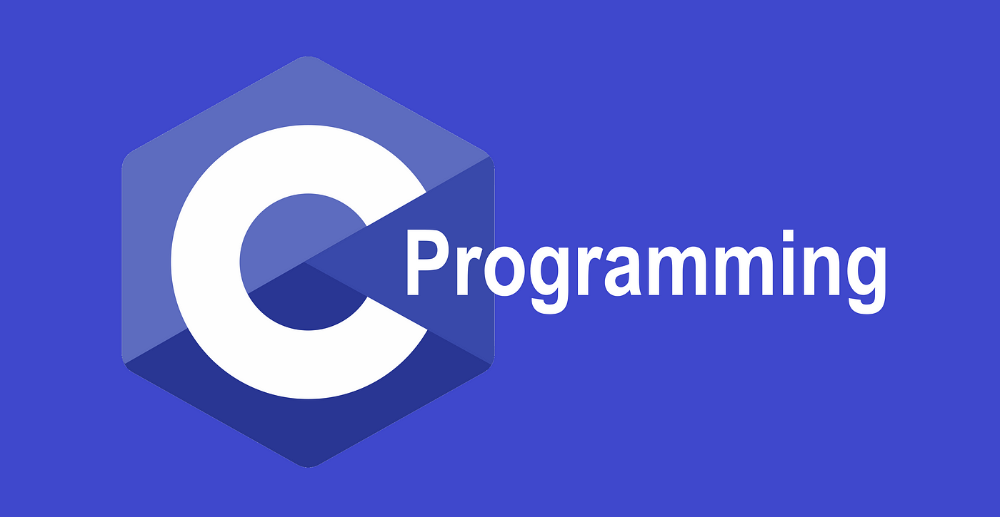

## Tabla de Contenido

- [Universidad C - Aprender El Lenguaje C desde cero](#universidad-c---aprender-el-lenguaje-c-desde-cero)
  - [Tabla de Contenido](#tabla-de-contenido)
  - [Introducción al lenguaje C](#introducción-al-lenguaje-c)
  - [Variables](#variables)
  - [Operadores](#operadores)
  - [Sentencias de Decisiones](#sentencias-de-decisiones)
  - [Ciclos](#ciclos)
  - [Arreglos](#arreglos)
  - [Matrices](#matrices)
  - [Funciones](#funciones)
  - [Funciones Incorporadas al lenguaje C](#funciones-incorporadas-al-lenguaje-c)

## Introducción al lenguaje C

- Lenguaje de Prooósito General
- Creado Por: **Dennis Ritchie**
- Es un Lenguaje Compilado
- Es multiplataforma
- Muchos lenguajes más modernos `extienden` del lenguaje C (C++, Java, C#, JavaScript)

**¿Qué es una función?**

Una función es un bloque de código que nos permite realizar alguna operación.

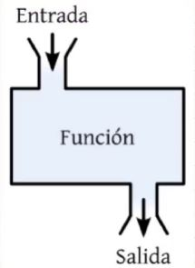

**Ejemplo:** Mandar a imprimir algo a consola.

**Hola Mundo con el lenguaje C**

```c
#inclue <stdio.h> // Libreria Standard Input/Output (Ej. función printf)

int main() {
  printf("Hola Mundo");
  return 0;
}
```

## Variables

**¿Qué es una variable?**

Una variable nos permite almacenar los datos de nuestros programas

**Se compone de varios elementos**

1. nombre
2. valor almacenado (tipo de dato)
3. Dirección de memoria

**Por ejemplo:**

```c
miVariable = 10;
```

---

**Tipos de Memoria (ROM y RAM)**

**ROM**

ROM = Read Only Memory (Memoria de Solo Lectura)

Los datos almacenados aquí no se pueden modificar.

**RAM**

RAM = Random Access Memory (Memoria de Acceso Aleatorio).

Esta memoria es de Lectura y Escritura. Por lo tanto, la usaremos para almacenar nuestros programas (Ej. **variables**)

---

**Cómo se almacena la información en la memoria RAM**

Ejemplo: Creamos una variables

```c
a = 10
b = 15
c = a // Se copia el valor
c = 20
```

| variables | Memoria RAM | Dirección memoria (referencia) |
| --------- | ----------- | ------------------------------ |
| a         | 10          | 0x333                          |
| b         | 15          | 0x344                          |
| c         | ~~10~~ 20   | 0x355                          |

> [!NOTE]
> Sistemas de Numeración como Binario, Octal, Decimal o Hexadecimal
>
> Si desean pueden buscar más información en Internet como: **Sistemas de Numeración**
>
> `c = 20` Solo se modificar el valor de **c**. El valor de no sse ve afectado => *Copia por valor*
> `0x355 = 20`

---

**Visualización de la memoria**

```c
miVariable = 10; // int -> 4 bytes
```

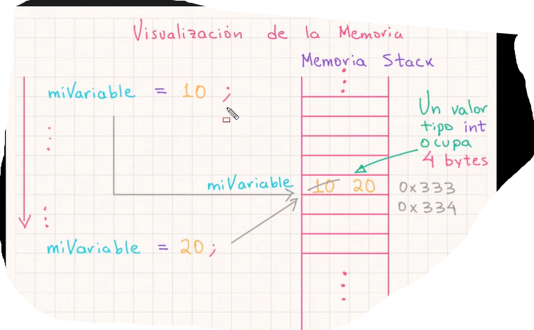

---

**Tipos de datos en C**

| Tipos  | Signifcado                       | EJemplos                          |
| ------ | -------------------------------- | --------------------------------- |
| int    | Entero                           | 10, -8, etc (4 bytes)             |
| float  | Real                             | 3.5, -6.9, etc (4 bytes)          |
| double | Real con más precisión que float | 3e39 (8 bytes)                    |
| char   | Caracter                         | `'A'` (1 byte)                    |
| bool   | Lógico                           | `true` (1) o `false` (0) (1 byte) |

---

**Sintaxis Variables en C**

`[calificado] <tipo> <nombre> = <valor>;`

**Ejemplo:** `int miVariable = 10;`

```c
# include <stdio.h>

int main() {

  // 1. Declarar una variable
  int miNumero;
  // 2. La inicializamos
  miNumero = 10;
  // 3. Imprimir variable
  // formato %d para imprimir un entero -> decimal o int
  printf("%d", miNumero);

  return 0;
}
```

---

**Modificación de variables en C**

```c
# include <stdio.h>

int main() {

  // 1. Declarar una variable
  int miNumero; // Tiene un valor basura
  printf("%d", miNumero);
  // 2. La inicializamos
  miNumero = 10;
  // 3. Imprimir variable
  // formato %d para imprimir un entero -> decimal o int
  // caracter especial \n para salto de línea
  printf("\n%d", miNumero);
  // 4. Modificamos el valor de la variable
  miNumero = 20; // Se sobreescribe el valor 10
  printf("\n%d", miNumero);

  return 0;
}
```

---

**Imprimir varias variables**

```c
# include <stdio.h>

int main() {

  // 1. Declarar varias variables
  int miNumero2 = 20, miNumero3 = 30;
  // 2. Imprimir el valor de las variables
  printf("Mi numero dos es: %d, \nmi numero tres es: %d", miNumero2, miNumero3);

  return 0;
}
```

---

**Reglas de Nombres de Variables en C**

```c
#include <stdio.h>

int main()
{
  // Reglas de Nombres de Variables en C
  // 1. Sensible a mayúsculas y minúsculas
  // 2. No podemos usar palabras reservadas (keyword)
  // 3. Cómo buena práctica, usar notación altas-bajas (camello)
  // 4. Debe iniciar con letras o guión bajo (_)
  // 5. No debe iniciar con números ni caracteres especiales (¡$%&)
  // 6. Despues del primer caracter, podemos usar guión bajo, letra o números
  // 7. Los nombres no puede contener espacios en blanco
  // 8. Se recomienda usar nombres descriptivos, no una sola letra.

  int miVariable = 10;
  // printf("%d", miVariable);// Arroja error ( C es sensible a mayúsculas y minúsculas)

  // int for = 20; // Arroja error (No podemos usar palabras reservadas)

  int miVariable = 30; // Aunque es válido, no es buena práctica.

  // Notación altas-bajas (camello)

  int miVariableEntera = 40;

  // Uso de guión bajo al inicio
  int _miVariable = 50;
  int mi_variable = 60;

  // Utilizar números pero después del primer caracter
  // int 1Mivariable = 70; // Arroja error (No debe iniciar con números)
  int miVariable1 = 80;

  // Nombres descriptivos
  int sm = 60;
  int segundosPorMinuto = 60;

  return 0;
}
```

---

**Ejemplo de Tipos de Datos en C**

```c
#include <stdio.h>
#include <stdbool.h>

/**
 * Tipos de datos básicos en C
 */

int main()
{
  // Tipo entero (formato %d, %i)
  int entero = 10;
  printf("Tipo entero: %i", entero);

  // Tipo flotante (formato %f)
  float flotante = 3800.5;
  printf("\nTipo flotante: %1.2f", flotante);

  // Tipo doble (formato %lf ->  long float)
  double doble = 20.5;
  printf("\nTipo doble: %.2lf", doble);

  // Tipo caracter (formato %c)
  char caracter = 'A';
  printf("\nTipo caracter: %c", caracter);
  printf("\nValor decimal caracter: %d", caracter);
  char caracterDecimal = 65;
  printf("\nTipo caracter decimal: %c", caracterDecimal);

  // Tipo bool (valores: true = 1 o false = 0)
  bool logico = true;
  printf("\nTipo logico: %d", logico);

  // Un arreglo es un conjunto de datos
  // se encuentran ubicados de formas consecutiva en la memoria.

  // Tipo cadena (formato %s -> string)
  char cadena[] = "Hola";
  printf("\nTipo Cadena: %s", cadena);

  // Tipo cadena (otra sintaxis)
  char cadena2[10] = "Saludos";
  // char cadena2[5] = "Saludos"; // Arroja error (longitud máximo de caracter era 6)
  printf("\nTipo Cadena2: %s", cadena2);

  return 0;
}
```

---

**Dirección de Memoria de una Variable**

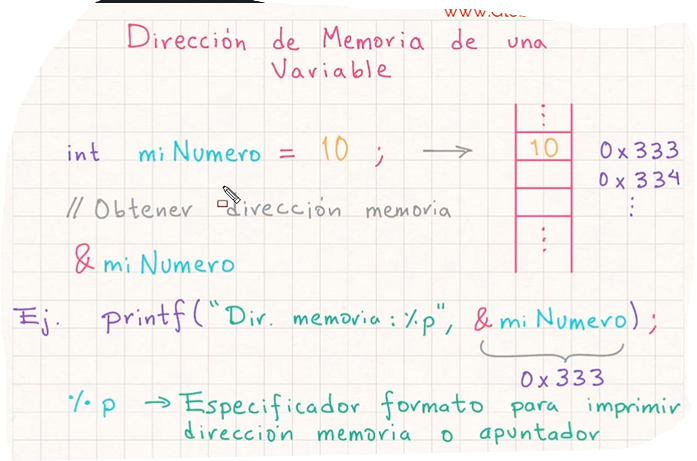

```c
#include <stdio.h>
#include <stdbool.h>

/*
Dirección de Memoria en C (apuntadores)
*/

int main()
{
  // Declarar una variable
  int miNumero = 10;
  printf("Imprimir el valor de variable: %d", miNumero);
  // Imprimimos la dirección de memoria
  printf("\nImprimir la dirección memoria: %p", &miNumero);

  return 0;
}
```

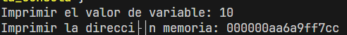

---

**Introducir datos por la consola**

```c
#include <stdio.h>

int main()
{
  // Ejemplo para solicitar información al usuario
  int miNumero;
  printf("Proporciona una numero: ");
  // leemos información del usuario
  scanf("%d", &miNumero);

  // Imprimimos el valor proporcionado
  printf("\nEl numero proporcionado es: %d", miNumero);
  return 0;
}
```

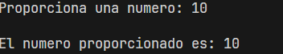

---

**Introducir Cadenas por Consola**

```c
// stdio => std - io
// std = standard,
// io -input/output (entrada/salida)
#include <stdio.h>

int main()
{
  // Ejemplo para solicitar información al usuario
  int tamanioCadena = 10;
  char nombre[tamanioCadena];
  printf("Proporciona un nombre: ");
  // leemos información del usuario
  scanf("%[^'\n']s", nombre);

  // Imprimimos el valor proporcionado
  printf("\nEl nombre proporcionado es: %s", nombre);
  return 0;
}
```

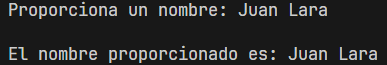

---

**Introducir Cadenas por Consola - Parte 2**

```c
// stdio => std - io
// std = standard,
// io -input/output (entrada/salida)
#include <stdio.h>

int main()
{
  // Ejemplo para solicitar información al usuario
  int tamanioCadena = 10;
  char nombre[tamanioCadena];
  printf("Proporciona un nombre: ");
  // leemos información del usuario
  // scanf("%[^'\n']s", nombre);
  // fgets(nombre, tamanioCadena, stdin); // standard input
  gets(nombre);

  // Imprimimos el valor proporcionado
  printf("\nEl nombre proporcionado es: %s", nombre);
  return 0;
}
```


---

**Ejercicio Propuesto: Datos de un Empleado**

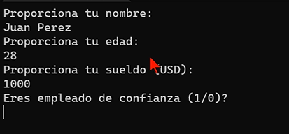
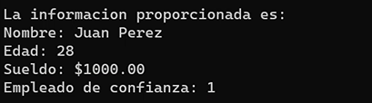

```c
#include <stdio.h>
#include <stdbool.h>

int main()
{
  // Ejercicio Tipos de Datos
  // Información de un Empleado
  // 1. Definimos las variables
  int edad;
  bool empleadoConfianza;
  int empleadoConfianzaTemp;
  int largoCadena = 50;
  char nombreCompleto[largoCadena];
  float sueldo;

  // 2. Solicitamos los valores al usuario
  printf("Proporciona tu nombre: \n");
  fgets(nombreCompleto, largoCadena, stdin);
  // gets(nombreCompleto);

  printf("Proporciona tu edad: \n");
  scanf("%d", edad);

  printf("Proporciona tu sueldo (USD): \n");
  scanf("%f", &sueldo);

  printf("Eres empleado de confianza (1/0)?: \n");
  scanf("%d", &empleadoConfianzaTemp);
  empleadoConfianza = empleadoConfianzaTemp;

  // 3. Imprimimos la información
  printf("\nLa información proporcionada es:");
  printf("\nNombre: %s", nombreCompleto);
  printf("\nEdad: %d", edad);
  printf("\nSueldo: $%.2f", sueldo);
  printf("\nEmpleado de confianza: %d", empleadoConfianza);

  return 0;
}
```

---

**Constantes en C**

```c
const <tipo> <nombre> = valor;
```

Ej: `const int MI_CONSTANTE = 100;`

Una vez definido el valor de una constante ya no podemos modificarlo.

```c
#include <stdio.h>
// 2. Otra forma de definir una constante
#define PI 3.1416
// Utilizar la constante M_PI pero de la libreria march
#include <math.h>
// #include <cmath>

int main()
{
  // Manejo de Constantes en C
  // 1. Definir una constante
  const int MI_CONSTANTE = 10;
  // MI_CONSTANTE = 20; // Esto arroja un error no puede modificarlo
  printf("Valor constante: %d\n", MI_CONSTANTE);
  // Imprimimos el valor de la constante PI
  printf("Valor PI = %f\n", PI);
  // Imprimimos el valor PI de la libreria math
  printf("Valor PI Math = %f\n", M_PI);

  // Constante segundos por minuto
  const int SEGUNDOS_POR_MINUTO = 60;
  printf("Constante SEGUNDOS_POR_MINUTO = %d\n", SEGUNDOS_POR_MINUTO);

  return 0;
}
```

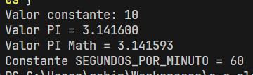

---

**Tamaño de Tipos de Datos en C**

```c
#include <stdio.h>
#include <stdbool.h>

int main()
{
  // sizeof
  // Definición variables
  int entero;
  float flotante;
  double doble;
  char caracter;
  char cadena[] = "Hola mundo";
  bool logico = false;

  // sizeof -> entero positivo (unsigned) long (lu) -> %lu
  // int -> signed (valores positivos y negativos)
  // Imprimir el tamanio en bytes de cada tipo de dato
  printf("int tamanio bytes: %lu\n", sizeof(entero));
  printf("float tamanio bytes: %lu\n", sizeof(flotante));
  printf("double tamanio bytes: %lu\n", sizeof(doble));
  printf("char tamanio bytes: %lu\n", sizeof(caracter));
  printf("char[] tamanio bytes: %lu\n", sizeof(cadena));
  printf("bool tamanio bytes: %lu\n", sizeof(logico));

  return 0;
}
```

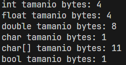

---

## Operadores

Los operadores nos permiten realizar operaciones al usar valores y variables

**Tipos de Operadores**

- Aritméticos
- Asignación
- Comparación
- Lógicos

**Operadores Aritméticos**

| Operadores | Significado               | Ejemplos  |
| ---------- | ------------------------- | --------- |
| +          | Suma                      | x + y     |
| -          | Resta                     | x - y     |
| *          | Multiplicación            | x * y     |
| /          | División                  | x / y     |
| %          | Modulo (Residua División) | x % y     |
| ++         | Incremento                | ++x o x++ |
| --         | Decremento                | --x o x-- |

---

**Operadores Aritméticos**

```c
#include <stdio.h>

int main()
{
  // Operadores Aritmeticos
  int a, b, c, e, f;
  float d;

  // Suma +
  a = 3 + 4;
  printf("Suma: %d\n", a);

  // Resta -
  b = 6 - 2;
  printf("Resta: %d\n", b);

  // Multiplicacion *
  c = a * 2;
  printf("Multiplicacion: %d\n", c);

  // Division /
  d = b / 2.5;
  printf("Division: %.2f\n", d);

  f = 9 % 2;
  printf("Residuo division: %d\n", f);

  return 0;
}
```

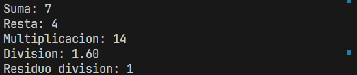

---

**Operadores Incremento y Decremento en C**

```c
#include <stdio.h>

int main()
{
  // Operadores de incremento
  int a, b, c;
  a = 0;

  // Pre-incremento
  ++a; // Primero se incrementa el valor
  printf("Nuevo valor de a: %d\n", a);

  // Post-incremento
  // Se usa el valor de la variable y después se incrementa
  printf("Valor de 'a' sin incrementar (a++): %d\n", a++);
  printf("Valor de 'a' ya que incrementarse (a): %d\n", a);

  // Ejemplo
  a = 5;
  b = 2;
  c = ++a * b++;
  printf("Valor a: %d\n", a);
  printf("Valor b: %d\n", b);
  printf("Valor c: %d\n", c);

  // Operadores de decremento
  a = 5;
  b = 2;
  c = --a * b--;
  printf("Valor a: %d\n", a); // No tenia un decremento pendiente
  printf("Valor b: %d\n", b); // tenia un decremento pendiente
  printf("Valor c: %d\n", c);

  return 0;
}
```

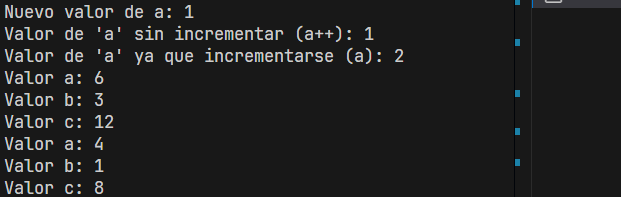

---

**Operadores de Asignación / Compuestos en C**

```c
#include <stdio.h>

int main()
{
  // Operadores de Asignacion
  // Operador = para asignar un valor
  int miNumero = 10;
  printf("Valor miNumero: %d\n", miNumero);
  // Modificar el valor de una variable
  miNumero = 20;
  printf("Valor miNumero: %d\n", miNumero);
  // Operador +=
  miNumero += 5; // miNumero = miNumero + 5;
  printf("Valor miNumero: %d\n", miNumero);
  // Operadores -=
  miNumero -= 3; // miNumero = miNumero - 3;
  printf("Valor miNumero: %d\n", miNumero);
  // Operadores *=
  miNumero *= 2; // miNumero = miNumero * 2;
  printf("Valor miNumero: %d\n", miNumero);
  // Operadores /=
  miNumero /= 7; // miNumero = miNumero / 7;
  printf("Valor miNumero: %d\n", miNumero);
  // Operadores %= (modulo o residuo division)
  miNumero %= 2; // miNumero = miNumero % 2;
  printf("Valor miNumero: %d\n", miNumero);

  return 0;
}
```

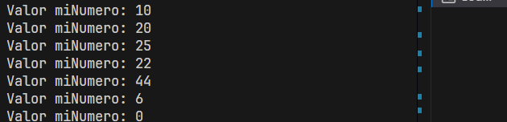

---

**Operadores relacionales en C**

| Operadores | Significado       | Ejemplos |
| ---------- | ----------------- | -------- |
| ==         | Igual a           | x == y   |
| !=         | Distinto a        | x != y   |
| >          | Mayor que         | x > y    |
| >=         | Mayor o igual que | x >= y   |
| <          | Menor que         | x < y    |
| <=         | Menor o igual que | x <= y   |


```c
#include <stdio.h>
#include <stdbool.h>

int main()
{
  // Operadores Relacionales (comparación)

  int a = 5, b = 6;
  printf("Valor  a: %d\n", a);
  printf("Valor  b: %d\n", b);

  // Operador igualdad
  bool c = a == b;
  printf("a igual que b? %d\n", c);
  // Operador distinto
  c = a != b;
  printf("a distinto que b? %d\n", c);
  // Operador mayor que
  c = a > b;
  printf("a mayor que b? %d\n", c);
  // Operador mayor que
  c = a > b;
  printf("a mayor que b? %d\n", c);
  // Operador mayor o igual que
  c = a >= b;
  printf("a mayor o igual que b? %d\n", c);
  // Operador menor que
  c = a < b;
  printf("a menor que b? %d\n", c);
  // Operador menor o igual que
  c = a <= b;
  printf("a menor o igual que b? %d\n", c);

  return 0;
}
```

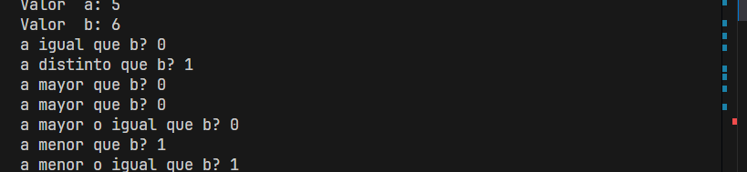

---

**Operadores Lógicos**

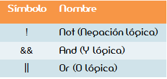

**&& and (y):** Regresa verdadero si ambos valores lógicos son verdaderos. Ej, `y && x`

**|| or (O):** Regresa verdadero si cualquiera de los operadores es verdadero. Ej, `x || y`

**! not (NO):** Invierte el resultado lógico `true` -> `false` o `false` -> `true`. Ej, `!x`

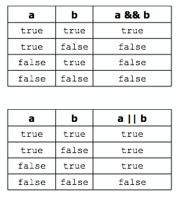

```c
#include <stdio.h>
#include <stdbool.h>

int main()
{
  // Operadores Lógicos
  bool a = true;  // Verdadero - 1
  bool b = false; // Falso - 0
  printf("Valor a: %d\n", a);
  printf("Valor b: %d\n", b);

  // Operador Lógico && (and - y)
  // Regresa verdadero si ambos operados son verdaderos
  bool c = a && b;
  printf("Resultado operador and: %d\n", c);

  // Operador Lógico || (or - o)
  // Regresa verdadero si cualquier operador es verdadero
  c = a || b;
  printf("Resultado operador or: %d\n", c);

  // Operador Lógico ! (not - NO)
  // Invierte el resultado lógico
  c = !a;
  printf("Resultado operador not: %d\n", c);

  return 0;
}
```

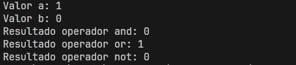

---


```c

```

**Ejercicio Propuesto: Valor Dentro de Rango**

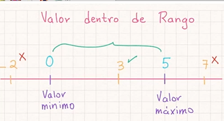

```c
#include <stdio.h>
#include <stdbool.h>

int main()
{
  // Ejericio Valor Dentro de Rango
  // Definimos las variables
  int minimo = 0, maximo = 5;
  // Solicitamos un valor entre 0 y 5
  int datos;
  printf("Proporciona un dato entre 0 y 5: ");
  scanf("%d", &datos);

  // Verificamos si estamos dentro de rango
  bool dentroRango = datos >= minimo && datos <= maximo;
  printf("Valor dentro de rango?: %d\n", dentroRango);

  return 0;
}
```

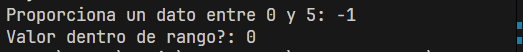

**Precedencia de Operadores**

```c
#include <stdio.h>
#include <stdbool.h>

int main() {
  // Precedencia de Operadores en C
  // 1. Parentesis y Corchetes
  // 2. Operadores unarios, como -, ++, --, !
  // 3. Aritmeticos *, / y %
  // 4. Aritmeticos + y -
  // 5. Relacionales <, <=, > y >=
  // 6. Igualdad/distinto == y !=
  // 7. Logicos && y ||
  // 8. Asignacion =, +=, -=, *=, etc.

  // Ejemplo: Se revisa de izquierda a derecha
  // int a = 12 / (3 + 2) * 3 - 1;
  int a = 12 / 3 + 2 * 3 - 1;
  printf("Resultado: %d", a);

  return 0;
}
```

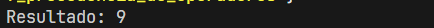

---

## Sentencias de Decisiones

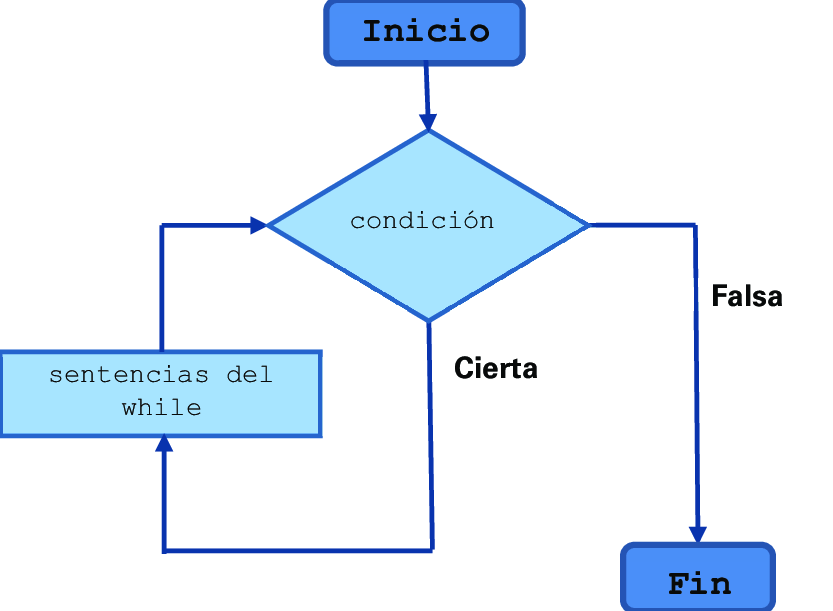

```c
if (condicion_boleana) {
  // instrucciones
}
```

---

**Ejemplo Sentencia IF en C**

```c
#include <stdio.h>
#include <stdbool.h>

int main()
{
  // Sentencia IF
  // Verificamos si el numero proporcionado es positivo
  printf("Proporciona un numero: ");
  int miNumero;
  scanf("%d", &miNumero);

  // Verificamos si el numero es positivo
  if (miNumero > 0)
  {
    printf("Valor positivo: %d\n", miNumero);
  }

  return 0;
}
```

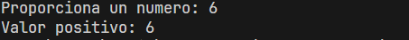

---

**Sentencia IF ELSE en C**

```c
#include <stdio.h>
#include <stdbool.h>

int main()
{
  // Sentencia IF
  // Verificamos si el numero proporcionado es positivo
  printf("Proporciona un numero: ");
  int miNumero;
  scanf("%d", &miNumero);

  // Verificamos si el numero es positivo
  if (miNumero > 0)
  {
    printf("Valor positivo: %d\n", miNumero);
  }
  else
  {
    printf("Valor Cero o Negativo: %d\n", miNumero);
  }

  return 0;
}
```

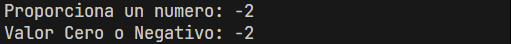

---

**Sentencia IF - ELSE IF - ELSE en C**

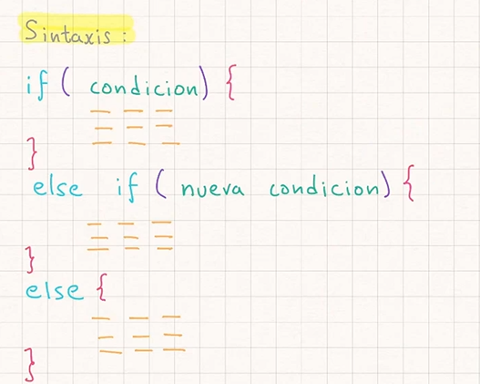

```c
#include <stdio.h>
#include <stdbool.h>

int main()
{
  // Sentencia IF
  // Verificamos si el numero proporcionado es positivo
  printf("Proporciona un numero: ");
  int miNumero;
  scanf("%d", &miNumero);

  // Verificamos si el numero es positivo
  if (miNumero > 0)
  {
    printf("Valor positivo: %d\n", miNumero);
  }
  else if (miNumero < 0)
  {
    printf("Valor Negativo: %d\n", miNumero);
  }
  else
  {
    printf("Valor Cero: %d\n", miNumero);
  }

  return 0;
}
```

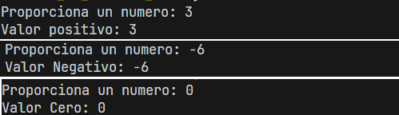

---

**Operador Ternario**

Es una simplificación de la sentencia if/else

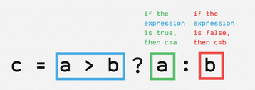


```c
#include <stdio.h>
#include <stdbool.h>

int main()
{
  // Sentencia IF
  // Verificamos si el numero proporcionado es positivo
  printf("Proporciona un numero: ");
  int miNumero;
  scanf("%d", &miNumero);

  // Verificamos si el numero es positivo, cero o negativo
  // Operador Ternario
  (miNumero > 0) ? printf("Positivo") : printf("Cero o Negativo");

  return 0;
}
```

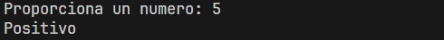

---

**Ejercicio Propuesto: Mayor de Edad**

```c
#include <stdio.h>
#include <stdbool.h>

int main()
{
  // Algoritmo Mayor Edad
  printf("Proporciona tu edad: ");
  int edad;
  scanf("%d", &edad);

  // Revisamos si la edad es mayor de edad
  if (edad >= 18)
  {
    printf("La persona con edad %d es un mayor de edad\n");
  }
  else if (edad > 0 && edad < 18)
  {
    printf("La persona con edad %d es un menor");
  }
  else
  {
    printf("Proporcionado es inválido");
  }

  return 0;
}
```

**Ejemplo Día de la Semana - Sentencia if else**

```c
#include <stdio.h>
#include <stdbool.h>

int main()
{
  // Dia de la semana (if-else)
  int diaSemana;
  printf("Proporciona el dia de la semana");
  scanf("%d", &diaSemana);

  // Revisamos que dia de la semana es
  if (diaSemana == 1)
  {
    printf("Lunes\n");
  }
  else if (diaSemana == 2)
  {
    printf("Martes\n");
  }
  else if (diaSemana == 3)
  {
    printf("Miércoles\n");
  }
  else if (diaSemana == 4)
  {
    printf("Jueves\n");
  }
  else if (diaSemana == 5)
  {
    printf("Viernes\n");
  }
  else if (diaSemana == 6)
  {
    printf("Sábado\n");
  }
  else if (diaSemana == 7)
  {
    printf("Domingo\n");
  }
  else
  {
    printf("Valor dia errores: %d\n", diaSemana);
  }

  return 0;
}
```

---

**Sentencia switch**

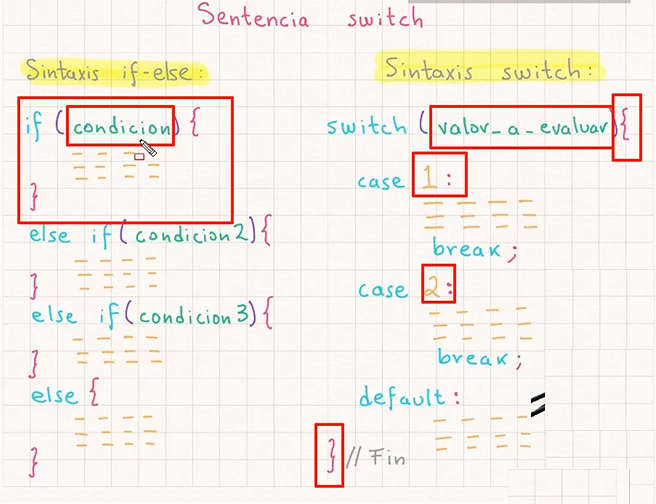

```c
#include <stdio.h>

int main()
{
  // Dia de la semana (if-else)
  int diaSemana;
  printf("Proporciona el dia de la semana");
  scanf("%d", &diaSemana);

  // Revision dia de la semana - switch
  switch (diaSemana)
  {
  case 1:
    printf("Lunes\n");
    break;
  case 2:
    printf("Martes\n");
    break;
  case 3:
    printf("Miércoles\n");
    break;
  case 4:
    printf("Jueves\n");
    break;
  case 5:
    printf("Viernes\n");
    break;
  case 6:
    printf("Sábado\n");
    break;
  case 7:
    printf("Domingo\n");
    break;

  default:
    printf("Valor dia errores: %d\n", diaSemana);
    break;
  }

  return 0;
}
```

---


## Ciclos

## Arreglos

## Matrices

## Funciones

## Funciones Incorporadas al lenguaje C
