# Universidad C - Aprender El Lenguaje C desde cero


---

## Tabla de Contenido

- [Universidad C - Aprender El Lenguaje C desde cero](#universidad-c---aprender-el-lenguaje-c-desde-cero)
  - [Tabla de Contenido](#tabla-de-contenido)
  - [Introducción al lenguaje C](#introducción-al-lenguaje-c)
    - [¿Qué es una función?](#qué-es-una-función)
    - [Hola Mundo con el lenguaje C](#hola-mundo-con-el-lenguaje-c)
  - [Variables](#variables)
    - [Tipos de Memoria (ROM y RAM)](#tipos-de-memoria-rom-y-ram)
    - [Cómo se almacena la información en la memoria RAM](#cómo-se-almacena-la-información-en-la-memoria-ram)
    - [Visualización de la memoria](#visualización-de-la-memoria)
    - [Tipos de datos en C](#tipos-de-datos-en-c)
    - [Sintáxis Variables en C](#sintáxis-variables-en-c)
    - [Modificación de variables en C](#modificación-de-variables-en-c)
    - [Imprimir varias variables](#imprimir-varias-variables)
    - [Reglas de Nombres de Variables en C](#reglas-de-nombres-de-variables-en-c)
    - [Ejemplo de Tipos de Datos en C](#ejemplo-de-tipos-de-datos-en-c)
    - [Dirección de Memoria de una Variable](#dirección-de-memoria-de-una-variable)
    - [Introducir datos por la consola](#introducir-datos-por-la-consola)
    - [Introducir Cadenas por Consola](#introducir-cadenas-por-consola)
    - [Introducir Cadenas por Consola - Parte 2](#introducir-cadenas-por-consola---parte-2)
    - [Ejercicio Propuesto: Datos de un Empleado](#ejercicio-propuesto-datos-de-un-empleado)
    - [Constantes en C](#constantes-en-c)
    - [Tamaño de Tipos de Datos en C](#tamaño-de-tipos-de-datos-en-c)
  - [Operadores](#operadores)
    - [Operadores Aritméticos](#operadores-aritméticos)
    - [Operadores Incremento y Decremento en C](#operadores-incremento-y-decremento-en-c)
    - [Operadores de Asignación / Compuestos en C](#operadores-de-asignación--compuestos-en-c)
    - [Operadores relacionales en C](#operadores-relacionales-en-c)
    - [Operadores Lógicos](#operadores-lógicos)
    - [Ejercicio Propuesto: Valor Dentro de Rango](#ejercicio-propuesto-valor-dentro-de-rango)
  - [Sentencias de Decisiones](#sentencias-de-decisiones)
    - [Ejemplo Sentencia IF en C](#ejemplo-sentencia-if-en-c)
    - [Sentencia IF ELSE en C](#sentencia-if-else-en-c)
    - [Sentencia IF - ELSE IF - ELSE en C](#sentencia-if---else-if---else-en-c)
    - [Operador Ternario](#operador-ternario)
    - [Ejercicio Propuesto: Mayor de Edad](#ejercicio-propuesto-mayor-de-edad)
    - [Ejemplo Día de la Semana - Sentencia if else](#ejemplo-día-de-la-semana---sentencia-if-else)
    - [Sentencia switch](#sentencia-switch)
  - [Ciclos](#ciclos)
    - [Ejemplo Ciclo `while` en C](#ejemplo-ciclo-while-en-c)
    - [Detalle Ciclo `while` en C](#detalle-ciclo-while-en-c)
    - [Ciclo `do while` en C](#ciclo-do-while-en-c)
    - [Ciclo `for` en C](#ciclo-for-en-c)
    - [Ejemplo Ciclo `for` en C](#ejemplo-ciclo-for-en-c)
    - [Ejericio Propuesto: Impresión de 3 en 3 en C](#ejericio-propuesto-impresión-de-3-en-3-en-c)
    - [Ejercicio propuesto: Suma Acumulativa en C](#ejercicio-propuesto-suma-acumulativa-en-c)
    - [Ejercicio propuesto: Suma Acumulativa con `while` y `do-while`](#ejercicio-propuesto-suma-acumulativa-con-while-y-do-while)
  - [Arreglos](#arreglos)
    - [Modificar y Leer de los Valores de un Arreglo en C](#modificar-y-leer-de-los-valores-de-un-arreglo-en-c)
    - [Ejemplo de Arreglo en C](#ejemplo-de-arreglo-en-c)
    - [Sintáxis Simplificado de Arreglos](#sintáxis-simplificado-de-arreglos)
    - [Iteración de un Arreglo en C](#iteración-de-un-arreglo-en-c)
    - [Obtener el largo de un arreglo en C](#obtener-el-largo-de-un-arreglo-en-c)
    - [Introducir Datos a un Arreglo en C](#introducir-datos-a-un-arreglo-en-c)
  - [Matrices](#matrices)
    - [Modificar y Leer de los valores de una Matriz](#modificar-y-leer-de-los-valores-de-una-matriz)
    - [Ejercicio Matrices](#ejercicio-matrices)
    - [Sintáxis Simplificado de Matrices](#sintáxis-simplificado-de-matrices)
    - [Ejemplo Sintáxis Simplificado Para Declarar Matrices](#ejemplo-sintáxis-simplificado-para-declarar-matrices)
    - [Iterar una Matriz en C](#iterar-una-matriz-en-c)
    - [Ejemplo Iterar una Matriz en C](#ejemplo-iterar-una-matriz-en-c)
    - [Introducir Datos a una Matriz en C](#introducir-datos-a-una-matriz-en-c)
  - [Funciones](#funciones)
    - [Sintáxis de una Función](#sintáxis-de-una-función)
    - [Argumentos y Parámetros en una Función](#argumentos-y-parámetros-en-una-función)
    - [Tipos de Funciones en C](#tipos-de-funciones-en-c)
    - [Ejemplo de creación de un Procedimiento en C](#ejemplo-de-creación-de-un-procedimiento-en-c)
    - [Ejemplo de una Función en C](#ejemplo-de-una-función-en-c)
    - [Copia de Valores](#copia-de-valores)
    - [Ejemplo de Copia de valores](#ejemplo-de-copia-de-valores)
    - [Apuntadores (Copia de la Referencia de Memoria)](#apuntadores-copia-de-la-referencia-de-memoria)
    - [Ejemplo de Apuntadores en C](#ejemplo-de-apuntadores-en-c)
    - [Paso por Valor](#paso-por-valor)
    - [Ejemplo de Paso por Valor en c](#ejemplo-de-paso-por-valor-en-c)
    - [Paso por Referencia](#paso-por-referencia)
    - [Ejemplo de Paso por Referencia en C](#ejemplo-de-paso-por-referencia-en-c)
    - [Arreglos y Apuntadores en C](#arreglos-y-apuntadores-en-c)
    - [Ejemplo Arreglos y Apuntadores en C](#ejemplo-arreglos-y-apuntadores-en-c)
    - [Ejemplo de Cadena y Funciones en C](#ejemplo-de-cadena-y-funciones-en-c)
    - [Más de Cadenas y Apuntadores en C](#más-de-cadenas-y-apuntadores-en-c)
    - [Alcance de Variables en C](#alcance-de-variables-en-c)
    - [Ejemplo de Alcance de Variables en C](#ejemplo-de-alcance-de-variables-en-c)
    - [Funciones Recursivas en C](#funciones-recursivas-en-c)
    - [Ejemplo de Funciones Recursivas en C](#ejemplo-de-funciones-recursivas-en-c)
  - [Funciones Incorporadas al lenguaje C](#funciones-incorporadas-al-lenguaje-c)
  - [Conclusión](#conclusión)

---

## Introducción al lenguaje C

- Lenguaje de Prooósito General
- Creado Por: **Dennis Ritchie**
- Es un Lenguaje Compilado
- Es multiplataforma
- Muchos lenguajes más modernos `extienden` del lenguaje C (C++, Java, C#, JavaScript)

### ¿Qué es una función?

Una función es un bloque de código que nos permite realizar alguna operación.


**Ejemplo:** Mandar a imprimir algo a consola.

### Hola Mundo con el lenguaje C

```c
#inclue <stdio.h> // Libreria Standard Input/Output (Ej. función printf)

int main() {
  printf("Hola Mundo");
  return 0;
}
```

## Variables

**¿Qué es una variable?**

  Una variable nos permite almacenar los datos de nuestros programas

**Se compone de varios elementos:**

1. nombre
2. valor almacenado (tipo de dato)
3. Dirección de memoria

**Por ejemplo:**

```c
miVariable = 10;
```

### Tipos de Memoria (ROM y RAM)

**ROM:**

ROM = Read Only Memory (Memoria de Solo Lectura)

Los datos almacenados aquí no se pueden modificar.

**RAM:**

RAM = Random Access Memory (Memoria de Acceso Aleatorio).

Esta memoria es de Lectura y Escritura. Por lo tanto, la usaremos para almacenar nuestros programas (Ej. **variables**)

### Cómo se almacena la información en la memoria RAM

**Ejemplo:** Creamos una variables

```c
a = 10
b = 15
c = a // Se copia el valor
c = 20
```

| variables | Memoria RAM | Dirección memoria (referencia) |
| --------- | ----------- | ------------------------------ |
| a         | 10          | 0x333                          |
| b         | 15          | 0x344                          |
| c         | ~~10~~ 20   | 0x355                          |

> [!NOTE]
> Sistemas de Numeración como Binario, Octal, Decimal o Hexadecimal
>
> Si desean pueden buscar más información en Internet como: **Sistemas de Numeración**
>
> `c = 20` Solo se modificar el valor de **c**. El valor de no sse ve afectado => *Copia por valor*
> `0x355 = 20`

### Visualización de la memoria

```c
miVariable = 10; // int -> 4 bytes
```


### Tipos de datos en C

| Tipos  | Signifcado                       | EJemplos                          |
| ------ | -------------------------------- | --------------------------------- |
| int    | Entero                           | 10, -8, etc (4 bytes)             |
| float  | Real                             | 3.5, -6.9, etc (4 bytes)          |
| double | Real con más precisión que float | 3e39 (8 bytes)                    |
| char   | Caracter                         | `'A'` (1 byte)                    |
| bool   | Lógico                           | `true` (1) o `false` (0) (1 byte) |

### Sintáxis Variables en C

`[calificado] <tipo> <nombre> = <valor>;`

**Ejemplo:** `int miVariable = 10;`

```c
# include <stdio.h>

int main() {

  // 1. Declarar una variable
  int miNumero;
  // 2. La inicializamos
  miNumero = 10;
  // 3. Imprimir variable
  // formato %d para imprimir un entero -> decimal o int
  printf("%d", miNumero);

  return 0;
}
```

### Modificación de variables en C

```c
# include <stdio.h>

int main() {

  // 1. Declarar una variable
  int miNumero; // Tiene un valor basura
  printf("%d", miNumero);
  // 2. La inicializamos
  miNumero = 10;
  // 3. Imprimir variable
  // formato %d para imprimir un entero -> decimal o int
  // caracter especial \n para salto de línea
  printf("\n%d", miNumero);
  // 4. Modificamos el valor de la variable
  miNumero = 20; // Se sobreescribe el valor 10
  printf("\n%d", miNumero);

  return 0;
}
```

### Imprimir varias variables

```c
# include <stdio.h>

int main() {

  // 1. Declarar varias variables
  int miNumero2 = 20, miNumero3 = 30;
  // 2. Imprimir el valor de las variables
  printf("Mi numero dos es: %d, \nmi numero tres es: %d", miNumero2, miNumero3);

  return 0;
}
```

### Reglas de Nombres de Variables en C

```c
#include <stdio.h>

int main()
{
  // Reglas de Nombres de Variables en C
  // 1. Sensible a mayúsculas y minúsculas
  // 2. No podemos usar palabras reservadas (keyword)
  // 3. Cómo buena práctica, usar notación altas-bajas (camello)
  // 4. Debe iniciar con letras o guión bajo (_)
  // 5. No debe iniciar con números ni caracteres especiales (¡$%&)
  // 6. Despues del primer caracter, podemos usar guión bajo, letra o números
  // 7. Los nombres no puede contener espacios en blanco
  // 8. Se recomienda usar nombres descriptivos, no una sola letra.

  int miVariable = 10;
  // printf("%d", miVariable);// Arroja error ( C es sensible a mayúsculas y minúsculas)

  // int for = 20; // Arroja error (No podemos usar palabras reservadas)

  int miVariable = 30; // Aunque es válido, no es buena práctica.

  // Notación altas-bajas (camello)

  int miVariableEntera = 40;

  // Uso de guión bajo al inicio
  int _miVariable = 50;
  int mi_variable = 60;

  // Utilizar números pero después del primer caracter
  // int 1Mivariable = 70; // Arroja error (No debe iniciar con números)
  int miVariable1 = 80;

  // Nombres descriptivos
  int sm = 60;
  int segundosPorMinuto = 60;

  return 0;
}
```

### Ejemplo de Tipos de Datos en C

```c
#include <stdio.h>
#include <stdbool.h>

/**
 * Tipos de datos básicos en C
 */

int main()
{
  // Tipo entero (formato %d, %i)
  int entero = 10;
  printf("Tipo entero: %i", entero);

  // Tipo flotante (formato %f)
  float flotante = 3800.5;
  printf("\nTipo flotante: %1.2f", flotante);

  // Tipo doble (formato %lf ->  long float)
  double doble = 20.5;
  printf("\nTipo doble: %.2lf", doble);

  // Tipo caracter (formato %c)
  char caracter = 'A';
  printf("\nTipo caracter: %c", caracter);
  printf("\nValor decimal caracter: %d", caracter);
  char caracterDecimal = 65;
  printf("\nTipo caracter decimal: %c", caracterDecimal);

  // Tipo bool (valores: true = 1 o false = 0)
  bool logico = true;
  printf("\nTipo logico: %d", logico);

  // Un arreglo es un conjunto de datos
  // se encuentran ubicados de formas consecutiva en la memoria.

  // Tipo cadena (formato %s -> string)
  char cadena[] = "Hola";
  printf("\nTipo Cadena: %s", cadena);

  // Tipo cadena (otra sintáxis)
  char cadena2[10] = "Saludos";
  // char cadena2[5] = "Saludos"; // Arroja error (longitud máximo de caracter era 6)
  printf("\nTipo Cadena2: %s", cadena2);

  return 0;
}
```

### Dirección de Memoria de una Variable


```c
#include <stdio.h>
#include <stdbool.h>

/*
Dirección de Memoria en C (apuntadores)
*/

int main()
{
  // Declarar una variable
  int miNumero = 10;
  printf("Imprimir el valor de variable: %d", miNumero);
  // Imprimimos la dirección de memoria
  printf("\nImprimir la dirección memoria: %p", &miNumero);

  return 0;
}
```


### Introducir datos por la consola

```c
#include <stdio.h>

int main()
{
  // Ejemplo para solicitar información al usuario
  int miNumero;
  printf("Proporciona una numero: ");
  // leemos información del usuario
  scanf("%d", &miNumero);

  // Imprimimos el valor proporcionado
  printf("\nEl numero proporcionado es: %d", miNumero);
  return 0;
}
```


### Introducir Cadenas por Consola

```c
// stdio => std - io
// std = standard,
// io -input/output (entrada/salida)
#include <stdio.h>

int main()
{
  // Ejemplo para solicitar información al usuario
  int tamanioCadena = 10;
  char nombre[tamanioCadena];
  printf("Proporciona un nombre: ");
  // leemos información del usuario
  scanf("%[^'\n']s", nombre);

  // Imprimimos el valor proporcionado
  printf("\nEl nombre proporcionado es: %s", nombre);
  return 0;
}
```


### Introducir Cadenas por Consola - Parte 2

```c
// stdio => std - io
// std = standard,
// io -input/output (entrada/salida)
#include <stdio.h>

int main()
{
  // Ejemplo para solicitar información al usuario
  int tamanioCadena = 10;
  char nombre[tamanioCadena];
  printf("Proporciona un nombre: ");
  // leemos información del usuario
  // scanf("%[^'\n']s", nombre);
  // fgets(nombre, tamanioCadena, stdin); // standard input
  gets(nombre);

  // Imprimimos el valor proporcionado
  printf("\nEl nombre proporcionado es: %s", nombre);
  return 0;
}
```


### Ejercicio Propuesto: Datos de un Empleado


```c
#include <stdio.h>
#include <stdbool.h>

int main()
{
  // Ejercicio Tipos de Datos
  // Información de un Empleado
  // 1. Definimos las variables
  int edad;
  bool empleadoConfianza;
  int empleadoConfianzaTemp;
  int largoCadena = 50;
  char nombreCompleto[largoCadena];
  float sueldo;

  // 2. Solicitamos los valores al usuario
  printf("Proporciona tu nombre: \n");
  fgets(nombreCompleto, largoCadena, stdin);
  // gets(nombreCompleto);

  printf("Proporciona tu edad: \n");
  scanf("%d", edad);

  printf("Proporciona tu sueldo (USD): \n");
  scanf("%f", &sueldo);

  printf("Eres empleado de confianza (1/0)?: \n");
  scanf("%d", &empleadoConfianzaTemp);
  empleadoConfianza = empleadoConfianzaTemp;

  // 3. Imprimimos la información
  printf("\nLa información proporcionada es:");
  printf("\nNombre: %s", nombreCompleto);
  printf("\nEdad: %d", edad);
  printf("\nSueldo: $%.2f", sueldo);
  printf("\nEmpleado de confianza: %d", empleadoConfianza);

  return 0;
}
```

### Constantes en C

```c
const <tipo> <nombre> = valor;
```

Ej: `const int MI_CONSTANTE = 100;`

Una vez definido el valor de una constante ya no podemos modificarlo.

```c
#include <stdio.h>
// 2. Otra forma de definir una constante
#define PI 3.1416
// Utilizar la constante M_PI pero de la libreria march
#include <math.h>
// #include <cmath>

int main()
{
  // Manejo de Constantes en C
  // 1. Definir una constante
  const int MI_CONSTANTE = 10;
  // MI_CONSTANTE = 20; // Esto arroja un error no puede modificarlo
  printf("Valor constante: %d\n", MI_CONSTANTE);
  // Imprimimos el valor de la constante PI
  printf("Valor PI = %f\n", PI);
  // Imprimimos el valor PI de la libreria math
  printf("Valor PI Math = %f\n", M_PI);

  // Constante segundos por minuto
  const int SEGUNDOS_POR_MINUTO = 60;
  printf("Constante SEGUNDOS_POR_MINUTO = %d\n", SEGUNDOS_POR_MINUTO);

  return 0;
}
```


### Tamaño de Tipos de Datos en C

```c
#include <stdio.h>
#include <stdbool.h>

int main()
{
  // sizeof
  // Definición variables
  int entero;
  float flotante;
  double doble;
  char caracter;
  char cadena[] = "Hola mundo";
  bool logico = false;

  // sizeof -> entero positivo (unsigned) long (lu) -> %lu
  // int -> signed (valores positivos y negativos)
  // Imprimir el tamanio en bytes de cada tipo de dato
  printf("int tamanio bytes: %lu\n", sizeof(entero));
  printf("float tamanio bytes: %lu\n", sizeof(flotante));
  printf("double tamanio bytes: %lu\n", sizeof(doble));
  printf("char tamanio bytes: %lu\n", sizeof(caracter));
  printf("char[] tamanio bytes: %lu\n", sizeof(cadena));
  printf("bool tamanio bytes: %lu\n", sizeof(logico));

  return 0;
}
```


---

## Operadores

Los operadores nos permiten realizar operaciones al usar valores y variables

**Tipos de Operadores:**

- Aritméticos
- Asignación
- Comparación
- Lógicos

**Operadores Aritméticos:**

| Operadores | Significado               | Ejemplos  |
| ---------- | ------------------------- | --------- |
| +          | Suma                      | x + y     |
| -          | Resta                     | x - y     |
| *          | Multiplicación            | x * y     |
| /          | División                  | x / y     |
| %          | Modulo (Residua División) | x % y     |
| ++         | Incremento                | ++x o x++ |
| --         | Decremento                | --x o x-- |

### Operadores Aritméticos

```c
#include <stdio.h>

int main()
{
  // Operadores Aritmeticos
  int a, b, c, e, f;
  float d;

  // Suma +
  a = 3 + 4;
  printf("Suma: %d\n", a);

  // Resta -
  b = 6 - 2;
  printf("Resta: %d\n", b);

  // Multiplicacion *
  c = a * 2;
  printf("Multiplicacion: %d\n", c);

  // Division /
  d = b / 2.5;
  printf("Division: %.2f\n", d);

  f = 9 % 2;
  printf("Residuo division: %d\n", f);

  return 0;
}
```


### Operadores Incremento y Decremento en C

```c
#include <stdio.h>

int main()
{
  // Operadores de incremento
  int a, b, c;
  a = 0;

  // Pre-incremento
  ++a; // Primero se incrementa el valor
  printf("Nuevo valor de a: %d\n", a);

  // Post-incremento
  // Se usa el valor de la variable y después se incrementa
  printf("Valor de 'a' sin incrementar (a++): %d\n", a++);
  printf("Valor de 'a' ya que incrementarse (a): %d\n", a);

  // Ejemplo
  a = 5;
  b = 2;
  c = ++a * b++;
  printf("Valor a: %d\n", a);
  printf("Valor b: %d\n", b);
  printf("Valor c: %d\n", c);

  // Operadores de decremento
  a = 5;
  b = 2;
  c = --a * b--;
  printf("Valor a: %d\n", a); // No tenia un decremento pendiente
  printf("Valor b: %d\n", b); // tenia un decremento pendiente
  printf("Valor c: %d\n", c);

  return 0;
}
```


### Operadores de Asignación / Compuestos en C

```c
#include <stdio.h>

int main()
{
  // Operadores de Asignacion
  // Operador = para asignar un valor
  int miNumero = 10;
  printf("Valor miNumero: %d\n", miNumero);
  // Modificar el valor de una variable
  miNumero = 20;
  printf("Valor miNumero: %d\n", miNumero);
  // Operador +=
  miNumero += 5; // miNumero = miNumero + 5;
  printf("Valor miNumero: %d\n", miNumero);
  // Operadores -=
  miNumero -= 3; // miNumero = miNumero - 3;
  printf("Valor miNumero: %d\n", miNumero);
  // Operadores *=
  miNumero *= 2; // miNumero = miNumero * 2;
  printf("Valor miNumero: %d\n", miNumero);
  // Operadores /=
  miNumero /= 7; // miNumero = miNumero / 7;
  printf("Valor miNumero: %d\n", miNumero);
  // Operadores %= (modulo o residuo division)
  miNumero %= 2; // miNumero = miNumero % 2;
  printf("Valor miNumero: %d\n", miNumero);

  return 0;
}
```


### Operadores relacionales en C

| Operadores | Significado       | Ejemplos |
| ---------- | ----------------- | -------- |
| ==         | Igual a           | x == y   |
| !=         | Distinto a        | x != y   |
| >          | Mayor que         | x > y    |
| >=         | Mayor o igual que | x >= y   |
| <          | Menor que         | x < y    |
| <=         | Menor o igual que | x <= y   |

```c
#include <stdio.h>
#include <stdbool.h>

int main()
{
  // Operadores Relacionales (comparación)

  int a = 5, b = 6;
  printf("Valor  a: %d\n", a);
  printf("Valor  b: %d\n", b);

  // Operador igualdad
  bool c = a == b;
  printf("a igual que b? %d\n", c);
  // Operador distinto
  c = a != b;
  printf("a distinto que b? %d\n", c);
  // Operador mayor que
  c = a > b;
  printf("a mayor que b? %d\n", c);
  // Operador mayor que
  c = a > b;
  printf("a mayor que b? %d\n", c);
  // Operador mayor o igual que
  c = a >= b;
  printf("a mayor o igual que b? %d\n", c);
  // Operador menor que
  c = a < b;
  printf("a menor que b? %d\n", c);
  // Operador menor o igual que
  c = a <= b;
  printf("a menor o igual que b? %d\n", c);

  return 0;
}
```


### Operadores Lógicos


**&& and (y):** Regresa verdadero si ambos valores lógicos son verdaderos. Ej, `y && x`

**|| or (O):** Regresa verdadero si cualquiera de los operadores es verdadero. Ej, `x || y`

**! not (NO):** Invierte el resultado lógico `true` -> `false` o `false` -> `true`. Ej, `!x`


```c
#include <stdio.h>
#include <stdbool.h>

int main()
{
  // Operadores Lógicos
  bool a = true;  // Verdadero - 1
  bool b = false; // Falso - 0
  printf("Valor a: %d\n", a);
  printf("Valor b: %d\n", b);

  // Operador Lógico && (and - y)
  // Regresa verdadero si ambos operados son verdaderos
  bool c = a && b;
  printf("Resultado operador and: %d\n", c);

  // Operador Lógico || (or - o)
  // Regresa verdadero si cualquier operador es verdadero
  c = a || b;
  printf("Resultado operador or: %d\n", c);

  // Operador Lógico ! (not - NO)
  // Invierte el resultado lógico
  c = !a;
  printf("Resultado operador not: %d\n", c);

  return 0;
}
```


### Ejercicio Propuesto: Valor Dentro de Rango


```c
#include <stdio.h>
#include <stdbool.h>

int main()
{
  // Ejericio Valor Dentro de Rango
  // Definimos las variables
  int minimo = 0, maximo = 5;
  // Solicitamos un valor entre 0 y 5
  int datos;
  printf("Proporciona un dato entre 0 y 5: ");
  scanf("%d", &datos);

  // Verificamos si estamos dentro de rango
  bool dentroRango = datos >= minimo && datos <= maximo;
  printf("Valor dentro de rango?: %d\n", dentroRango);

  return 0;
}
```


**Precedencia de Operadores:**

```c
#include <stdio.h>
#include <stdbool.h>

int main() {
  // Precedencia de Operadores en C
  // 1. Parentesis y Corchetes
  // 2. Operadores unarios, como -, ++, --, !
  // 3. Aritmeticos *, / y %
  // 4. Aritmeticos + y -
  // 5. Relacionales <, <=, > y >=
  // 6. Igualdad/distinto == y !=
  // 7. Logicos && y ||
  // 8. Asignacion =, +=, -=, *=, etc.

  // Ejemplo: Se revisa de izquierda a derecha
  // int a = 12 / (3 + 2) * 3 - 1;
  int a = 12 / 3 + 2 * 3 - 1;
  printf("Resultado: %d", a);

  return 0;
}
```


---

## Sentencias de Decisiones


```c
if (condicion_boleana) {
  // instrucciones
}
```

### Ejemplo Sentencia IF en C

```c
#include <stdio.h>
#include <stdbool.h>

int main()
{
  // Sentencia IF
  // Verificamos si el numero proporcionado es positivo
  printf("Proporciona un numero: ");
  int miNumero;
  scanf("%d", &miNumero);

  // Verificamos si el numero es positivo
  if (miNumero > 0)
  {
    printf("Valor positivo: %d\n", miNumero);
  }

  return 0;
}
```


### Sentencia IF ELSE en C

```c
#include <stdio.h>
#include <stdbool.h>

int main()
{
  // Sentencia IF
  // Verificamos si el numero proporcionado es positivo
  printf("Proporciona un numero: ");
  int miNumero;
  scanf("%d", &miNumero);

  // Verificamos si el numero es positivo
  if (miNumero > 0)
  {
    printf("Valor positivo: %d\n", miNumero);
  }
  else
  {
    printf("Valor Cero o Negativo: %d\n", miNumero);
  }

  return 0;
}
```


### Sentencia IF - ELSE IF - ELSE en C


```c
#include <stdio.h>
#include <stdbool.h>

int main()
{
  // Sentencia IF
  // Verificamos si el numero proporcionado es positivo
  printf("Proporciona un numero: ");
  int miNumero;
  scanf("%d", &miNumero);

  // Verificamos si el numero es positivo
  if (miNumero > 0)
  {
    printf("Valor positivo: %d\n", miNumero);
  }
  else if (miNumero < 0)
  {
    printf("Valor Negativo: %d\n", miNumero);
  }
  else
  {
    printf("Valor Cero: %d\n", miNumero);
  }

  return 0;
}
```


### Operador Ternario

Es una simplificación de la sentencia if/else


```c
#include <stdio.h>
#include <stdbool.h>

int main()
{
  // Sentencia IF
  // Verificamos si el numero proporcionado es positivo
  printf("Proporciona un numero: ");
  int miNumero;
  scanf("%d", &miNumero);

  // Verificamos si el numero es positivo, cero o negativo
  // Operador Ternario
  (miNumero > 0) ? printf("Positivo") : printf("Cero o Negativo");

  return 0;
}
```


### Ejercicio Propuesto: Mayor de Edad

```c
#include <stdio.h>
#include <stdbool.h>

int main()
{
  // Algoritmo Mayor Edad
  printf("Proporciona tu edad: ");
  int edad;
  scanf("%d", &edad);

  // Revisamos si la edad es mayor de edad
  if (edad >= 18)
  {
    printf("La persona con edad %d es un mayor de edad\n");
  }
  else if (edad > 0 && edad < 18)
  {
    printf("La persona con edad %d es un menor");
  }
  else
  {
    printf("Proporcionado es inválido");
  }

  return 0;
}
```

### Ejemplo Día de la Semana - Sentencia if else

```c
#include <stdio.h>
#include <stdbool.h>

int main()
{
  // Dia de la semana (if-else)
  int diaSemana;
  printf("Proporciona el dia de la semana");
  scanf("%d", &diaSemana);

  // Revisamos que dia de la semana es
  if (diaSemana == 1)
  {
    printf("Lunes\n");
  }
  else if (diaSemana == 2)
  {
    printf("Martes\n");
  }
  else if (diaSemana == 3)
  {
    printf("Miércoles\n");
  }
  else if (diaSemana == 4)
  {
    printf("Jueves\n");
  }
  else if (diaSemana == 5)
  {
    printf("Viernes\n");
  }
  else if (diaSemana == 6)
  {
    printf("Sábado\n");
  }
  else if (diaSemana == 7)
  {
    printf("Domingo\n");
  }
  else
  {
    printf("Valor dia errores: %d\n", diaSemana);
  }

  return 0;
}
```

### Sentencia switch


```c
#include <stdio.h>

int main()
{
  // Dia de la semana (if-else)
  int diaSemana;
  printf("Proporciona el dia de la semana");
  scanf("%d", &diaSemana);

  // Revision dia de la semana - switch
  switch (diaSemana)
  {
  case 1:
    printf("Lunes\n");
    break;
  case 2:
    printf("Martes\n");
    break;
  case 3:
    printf("Miércoles\n");
    break;
  case 4:
    printf("Jueves\n");
    break;
  case 5:
    printf("Viernes\n");
    break;
  case 6:
    printf("Sábado\n");
    break;
  case 7:
    printf("Domingo\n");
    break;

  default:
    printf("Valor dia errores: %d\n", diaSemana);
    break;
  }

  return 0;
}
```

---

## Ciclos

Un ciclo nos permite repetir un bloque de código mientra la condición sea verdadera.

**Tipos de Ciclos:**

- ciclo `while`
- ciclo `do while`
- ciclo `for`

**Ciclo `while`:**

Sintáxis:

```c
white(condicion) {
  // instrucciones
}
```

- La condición es un valor lógico (`true, false`)
- El ciclo while repite la ejecución del bloque de código mientras la condición sea verdadera (`true`)

### Ejemplo Ciclo `while` en C

```c
#include <stdio.h>

int main()
{
  // Ciclo while
  // Imprimir los numeros del 1 al 5
  int contador = 1, repeticiones = 5;

  // while
  while (contador <= repeticiones)
  {
    printf("%d\n", contador);
    contador++; // Incrementa el valor en 1
  }

  return 0;
}
```

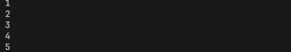

### Detalle Ciclo `while` en C

```c
#include <stdio.h>
#include <stdbool.h>

int main()
{
  // Ciclo while
  // Imprimir los numeros del 1 al 5
  int contador = 1, repeticiones = 5;

  // while
  while (contador <= repeticiones)
  {
    printf("Numero: %d\n", contador);
    contador++; // Incrementa el valor en 1
    // Condicion a evaluar
    bool condicion = contador <= repeticiones;
    printf("%d <= %d -> %d", contador, repeticiones, condicion);
  }

  return 0;
}
```

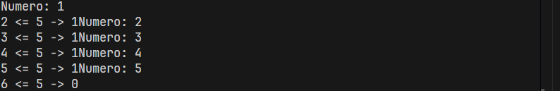

### Ciclo `do while` en C

Sintáxis:

```c
do {
  //instrucciones
} while(condicion);
```

- El ciclo `do while` ejecuta al menos una vez su bloque de código debido a que la condición a revisar se encuentra al final del bloque

**Ejemplo Ciclo `do while` en C:**

```c
#include <stdio.h>
#include <stdbool.h>

int main()
{
  // Ciclo do while
  // Repetir hasta que sea un valor positivo
  int numero;
  bool condicion;

  do
  {
    printf("Proporcione un numero positivo: ");
    scanf("%d", &numero);
    condicion = numero > 0;
  } while (!condicion);

  // Termina el ciclo
  printf("\nValor positivo: %d", numero);

  return 0;
}
```

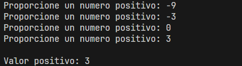

### Ciclo `for` en C

- Con ciclo `for` especificamos cuantas veces queremos repetir su bloque de código.

sintáxis:

```c
for (declaracion variables; condicion a evaluar; incremento contadores) {
  // Instrucciones -> Se ejecuta el bloque de código.
}
```

1. Se ejecuta solo una vez al inicio de la ejecución del ciclo `for`
2. Se repite el ciclo mientras la condición sea verdadera.
3. Se ejecuta el bloque de código
4. Se incrementan los contadores

> [!NOTE]
> Se repiten los pasos 2, 3 y 4 mientras la condición sea verdadera.

### Ejemplo Ciclo `for` en C

```c
#include <stdio.h>
#include <stdbool.h>

int main()
{
  // Ciclo for
  // Imprimir 1...5
  const int REPETICIONES = 5;
  for (int contador = 1; contador <= REPETICIONES; contador++)
  {
    printf("%d\n", contador);
  }

  return 0;
}
```

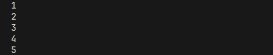

### Ejericio Propuesto: Impresión de 3 en 3 en C

```c

#include <stdio.h>
#include <stdbool.h>

int main()
{
  const int REPETICIONES = 10;
  // Incremento
  printf("Incrementos de 3 en 3 (Tope 10):\n");
  for (int i = 1; i <= 10; i += 3)
  {
    printf("%d ", i);
  }
  printf("\nDecrementos de 3 en 3 (Tope -10):\n");

  for (int j = 1; j >= -10; j -= 3)
  {
    printf("%d ", j);
  }

  return 0;
}
```

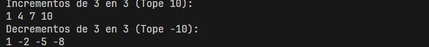

### Ejercicio propuesto: Suma Acumulativa en C

Realizar la suma de los primeros 5 números utilizando un ciclo `for`

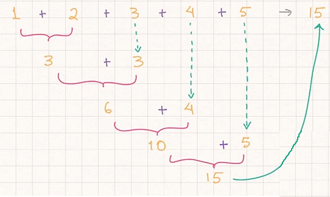

```c

#include <stdio.h>
#include <stdbool.h>

int main()
{
  // Ejercicio Propuesto: Suma Acumulativa
  int suma = 0, numero = 1;

  // ciclo For
  for (numero; numero <= 5; numero++)
  {
    printf("acumulador + numero: %d + %d\n", suma, numero);
    suma += numero;
    (numero < 5) ? printf("Suma parcial acumulada: %d\n", suma) : printf("Finaliza la suma acumulad: %d\n", suma);
  }
  printf("Fin de bloque de ciclo\n");

  return 0;
}
```

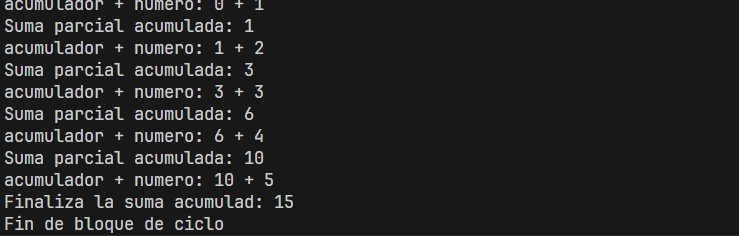

### Ejercicio propuesto: Suma Acumulativa con `while` y `do-while`

**Sintáxis de `while`:**

```c
#include <stdio.h>
#include <stdbool.h>

int main()
{
  // Ejercicio Propuesto: Suma Acumulativa
  int sumaAcumulada = 0, numero = 1;

  // While
  while (numero <= 5)
  {
    // Imprimimos lo que va a sumar (no altera el resultado de la suma)
    printf("acumulador + numero: %d + %d\n", sumaAcumulada, numero);
    // sumaAcumulada = sumaAcumulada + numero;
    sumaAcumulada += numero;
    // Imprimimos el resultado parcial y final de suma con condición
    (numero < 5) ? printf("Suma parcial acumulada: %d\n", sumaAcumulada) : printf("Finaliza la suma acumulativa total es: %d\n", sumaAcumulada);
    // Incrementamos la variable de numero
    numero++;
  }

  printf("Fin de bloque de ciclo\n");

  return 0;
}
```

**Sintáxis de `do while`:**

```c
#include <stdio.h>
#include <stdbool.h>

int main()
{
  // Ejercicio Propuesto: Suma Acumulativa
  int sumaAcumulada = 0, numero = 1;
  do
  {
    // Imprimimos lo que va a sumar (no altera el resultado de la suma)
    printf("acumulador + numero: %d + %d\n", sumaAcumulada, numero);
    // sumaAcumulada = sumaAcumulada + numero;
    sumaAcumulada += numero;
    // Imprimimos el resultado parcial y final de suma con condición
    (numero < 5) ? printf("Suma parcial acumulada: %d\n", sumaAcumulada) : printf("Finaliza la suma acumulativa total es: %d\n", sumaAcumulada);
    // Incrementamos la variable de numero
    numero++;
  } while (numero <= 5);

  printf("Fin de bloque de ciclo\n");

  return 0;
}
```

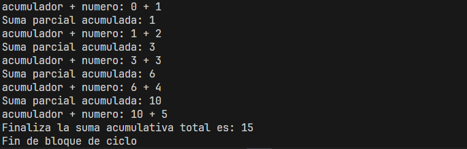

## Arreglos

Un arreglo nos permite almacenar múltiples valores en una sola variable, en lugar de definir varias variables.

**Sintáxis:**

`<tipo_dato> <nombre_arreglo>[tamañoArreglo];`

**Ejemplo:** `int numerosArreglo[5];`

En memoria se crea un arreglo:

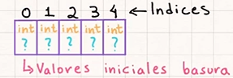

### Modificar y Leer de los Valores de un Arreglo en C

**Modificar de los Valores de un Arreglo:**

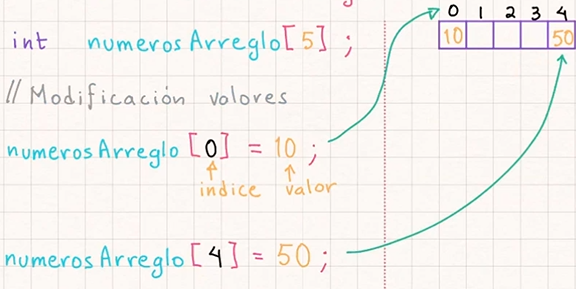

> [!NOTE]
> No es necesario modificar todos los valores del arreglo

**Leer de los Valores de un Arreglo:**

```c
int numerosArreglos[5];
// Modificamos algunos valores
numerosArreglos[0] = 10;
numerosArreglos[4] = 50;
// Leemos los valores de arreglo // Imprime
printf("%d", numerosArreglo[0]); // -> 10
printf("%d", numerosArreglo[0]); // -> ? -> valor basura
printf("%d", numerosArreglo[4]); // -> 50
```

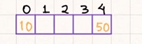

### Ejemplo de Arreglo en C

```c
#include <stdio.h>

int main()
{
  // Definir un arreglo
  int numerosArreglo[5];

  // Modificar los valores de un arreglo
  numerosArreglo[0] = 13;
  numerosArreglo[1] = 21;
  numerosArreglo[4] = 62;

  // Leer los valores del arreglo
  printf("Elemento 1 - Arreglo[0] = %d\n", numerosArreglo[0]);
  printf("Elemento 2 - Arreglo[1] = %d\n", numerosArreglo[1]);
  printf("Elemento 3 - Arreglo[2] = %d\n", numerosArreglo[2]);
  printf("Elemento 4 - Arreglo[3] = %d\n", numerosArreglo[3]);
  printf("Elemento 5 - Arreglo[4] = %d\n", numerosArreglo[4]);

  return 0;
}
```

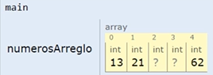

### Sintáxis Simplificado de Arreglos

```c
// Tamaño de arreglo =   0   1   2   3   5
int numerosArreglo[] = {100,200,300,400,500};
// [] -> no se especifica la cantidad de elementos
```

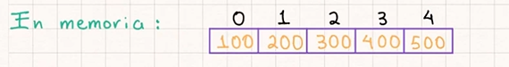

```c
#include <stdio.h>

int main()
{
  // Definir un arreglo
  int numerosArreglo[] = {100, 200, 300, 400, 500};

  // Modificar los valores de un arreglo
  // numerosArreglo[0] = 120;

  // Leer los valores del arreglo
  printf("Elemento 1 - Arreglo[0] = %d\n", numerosArreglo[0]);
  printf("Elemento 2 - Arreglo[1] = %d\n", numerosArreglo[1]);
  printf("Elemento 3 - Arreglo[2] = %d\n", numerosArreglo[2]);
  printf("Elemento 4 - Arreglo[3] = %d\n", numerosArreglo[3]);
  printf("Elemento 5 - Arreglo[4] = %d\n", numerosArreglo[4]);

  return 0;
}
```

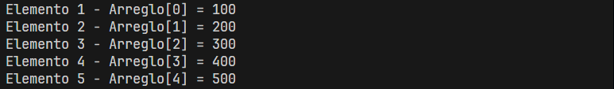

### Iteración de un Arreglo en C

```c
#include <stdio.h>

int main()
{
  // Definir un arreglo
  int numerosArreglo[] = {100, 200, 300, 400, 500};

  // Iterar un arreglo
  printf("Iteramos los valores del arreglo:\n");
  for (int i = 0; i < 5; i++)
  {
    printf("Arreglo[%d] = %d\n", i, numerosArreglo[i]);
  }

  return 0;
}
```

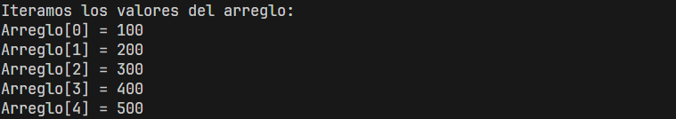

### Obtener el largo de un arreglo en C

```c
#include <stdio.h>

int main()
{
  // Definir un arreglo
  int numerosArreglo[] = {100, 200, 300, 400, 500};

  int largoArreglo;
  // Obtener el largo del arreglo dinamicamente
  // Memoria ocupada por todo el arreglo
  int tamanioArreglo = sizeof(numerosArreglo); // 5 x 4 = 20
  printf("Tamanio arreglo: %d\n", tamanioArreglo);

  // Memoria ocupada por un solo elemento
  int tamanioUnElemento = sizeof(numerosArreglo[0]);
  printf("Tamanio de un elemento del arreglo: %d\n", tamanioUnElemento);

  largoArreglo = tamanioArreglo / tamanioUnElemento;
  printf("Largo arreglo: %d\n", largoArreglo);

  // Iterar un arreglo
  printf("Iteramos los valores del arreglo:\n");
  for (int i = 0; i < largoArreglo; i++)
  {
    printf("Arreglo[%d] = %d\n", i, numerosArreglo[i]);
  }

  return 0;
}
```

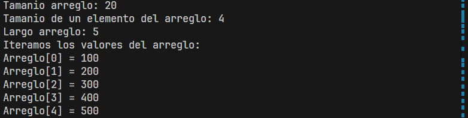

### Introducir Datos a un Arreglo en C

```c
#include <stdio.h>

int main()
{
  // Introducir valores de manera dinamica al arreglo
  int numeroElementos;
  printf("Proporciona el tamanio del arreglo: ");
  scanf("%d", &numeroElementos);

  // Crear el arreglo
  int numeros[numeroElementos];
  // Solicitamos al usuario los valores
  for (int i = 0; i < numeroElementos; i++)
  {
    printf("Arreglo[%d] = ", i);
    scanf("%d", &numeros[i]);
  }

  // Mandamos a imprimir
  for (int i = 0; i < numeroElementos; i++)
  {
    printf("\nArreglo[%d] = %d", i, numeros[i]);
  }

  return 0;
}
```

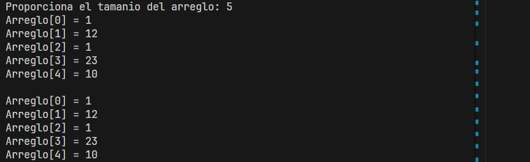

## Matrices

Una matriz es una arreglo de 2 dimensiones.

**Sintáxis:**

`<tipo_datos> <nombre_matriz>[renglones][columnas];`

**Ejemplo:**

```c
// 2 -> renglones
// 3 -> columnas
int matriz[2][3];
```

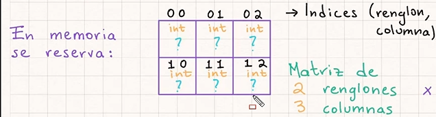

### Modificar y Leer de los valores de una Matriz

**Modificar los valores de una matriz:**

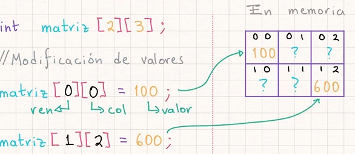

> [!NOTE]
> No es necesario modificar todos los valores de la matriz

**Leer los valores de una matriz:**

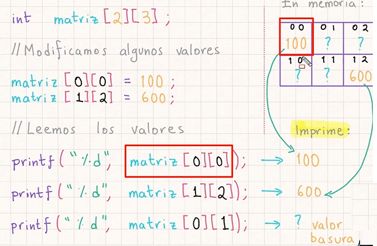

### Ejercicio Matrices

```c
#include <stdio.h>

int main()
{
  // Definir una matriz
  const int RENGLONES = 2;
  const int COLUMNAS = 3;
  int matriz[RENGLONES][COLUMNAS];

  // Modificar los valores de la matriz
  matriz[0][0] = 100;
  matriz[0][1] = 200;
  matriz[0][2] = 300;
  matriz[1][0] = 400;
  matriz[1][1] = 500;
  matriz[1][2] = 600;

  // Leer los valores de la matriz
  // int valor1 = matriz[0][0]
  printf("%d\n", matriz[0][0]); // -> 100
  printf("%d\n", matriz[1][2]); // -> 600

  return 0;
}
```

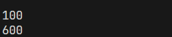

### Sintáxis Simplificado de Matrices

```c
int matriz[2][3] = {
  {100,200,300}, // -> Primer renglón
  {400,500,600}, // -> Segundo renglón
}
```

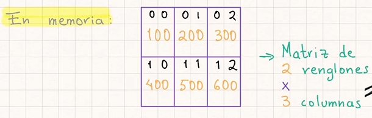

### Ejemplo Sintáxis Simplificado Para Declarar Matrices

```c
#include <stdio.h>
#define RENGLONES 2
#define COLUMNAS 3

int main()
{
  // Definir una matriz
  // const int RENGLONES = 2;
  // const int COLUMNAS = 3;
  int matriz[RENGLONES][COLUMNAS] = {
      {100, 200, 300},
      {400, 500, 600}};

  // Leer los valores de la matriz
  // int valor1 = matriz[0][0]
  printf("%d\n", matriz[0][0]); // -> 100
  printf("%d\n", matriz[1][2]); // -> 600

  return 0;
}
```

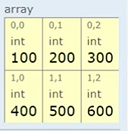


### Iterar una Matriz en C

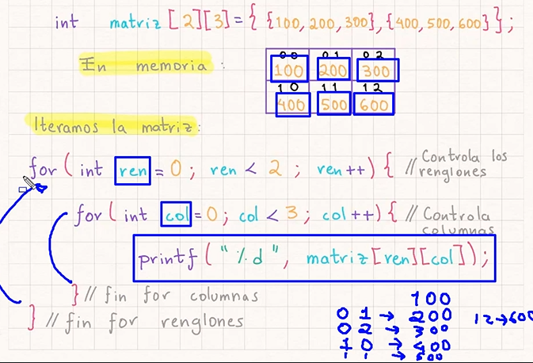

### Ejemplo Iterar una Matriz en C

```c
#include <stdio.h>
#define RENGLONES 2
#define COLUMNAS 3

int main()
{
  // Definir una matriz
  // const int RENGLONES = 2;
  // const int COLUMNAS = 3;
  int matriz[RENGLONES][COLUMNAS] = {
      {100, 200, 300},
      {400, 500, 600}};

  // Iteramos la matriz
  printf("------Iteramos la matriz------");
  for (int ren = 0; ren < RENGLONES; ren++)
  {
    printf("\nRenglon (pivote): %d", ren);
    for (int col = 0; col < COLUMNAS; col++)
    {
      printf("\nMatriz[%d][%d] = %d", ren, col, matriz[ren][col]);
    } // Fin for columnas
    printf("\n");
  } // Fin for renglones

  return 0;
}
```

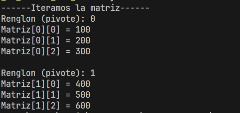

### Introducir Datos a una Matriz en C

```c
#include <stdio.h>

int main()
{
  // Introducir datos en una matriz
  int renglones, columnas;
  printf("Proporciona el numero de renglones: ");
  scanf("%d", &renglones);
  printf("Proporciona el numero de columnas: ");
  scanf("%d", &columnas);

  // Creamos la matriz
  int matriz[renglones][columnas];

  // Introducir los valores
  for (int ren = 0; ren < renglones; ren++)
  {
    for (int col = 0; col < columnas; col++)
    {
      printf("Matriz[%d][%d] = ", ren, col);
      scanf("%d", &matriz[ren][col]);
    }
  }

  // Imprimir los valores
  printf("-----Impresion de la Matriz-----\n");
  for (int ren = 0; ren < renglones; ren++)
  {
    for (int col = 0; col < columnas; col++)
    {
      printf("%d ", matriz[ren][col]);
    }
    printf("\n");
  }
}
```

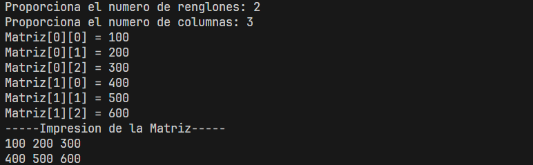

---

## Funciones

**Definición de Funciones:**

Una función es un bloque de código reutilizable, que realiza una tarea en particular.

Una función puede tener parámentros de entrada y también puede devolver un valor de salida

Tanto los valores de entrada, como los valores de salida de una función son opcionales

**Función de Manera Visual:**

**Ejemplo:** Función para sumar dos valores

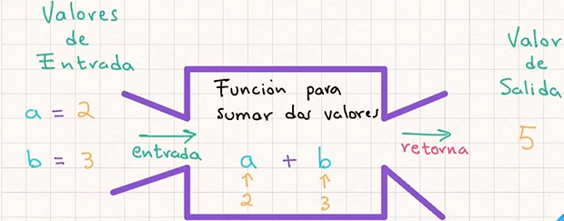

**Necesidad de los Funciones:**

Un programa de muchas líneas de código buscaremos dividirlo en funciones más pequeñas, con objetivos muy claros.

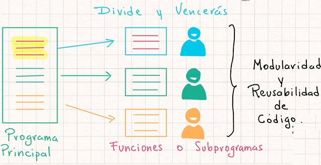

### Sintáxis de una Función

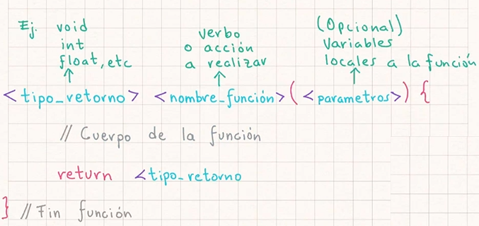

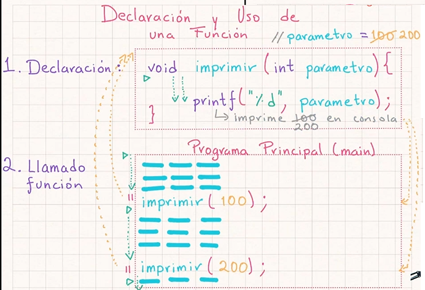

### Argumentos y Parámetros en una Función

**Diferencia entre Parámetros y Argumentos:**

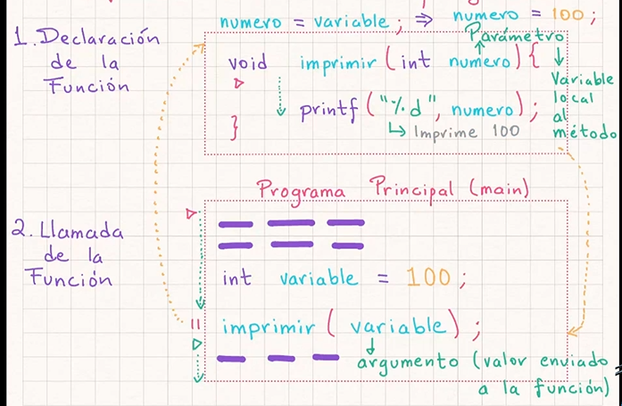

**Diferencia entre Procedimiento y Función:**

**Procedimiento:** No regresa ningún valor.

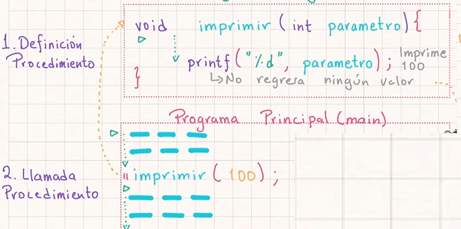

**Función:** Regresa un valor al terminar de ejecutarse

- Definición de una función

```c
int sumar(int a, int b) {
  int resultado a + b;
  return resultado;
}
```

- Llamada de la función

```c
// Programa principal (main)
  int a = 2, b = 3, c;
  c = sumar(a, b);

  printf("%d", c);
```

### Tipos de Funciones en C

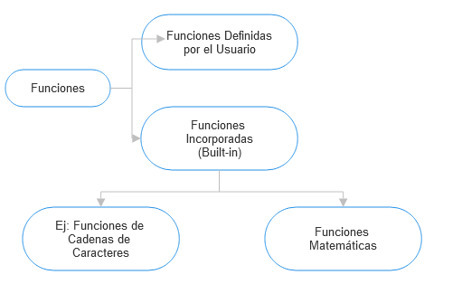

### Ejemplo de creación de un Procedimiento en C

```c
#include <stdio.h>

// 1. Definir el procedimiento
void imprimir(int parametro)
{
  printf("El valor recibido es: %d\n", parametro);
}

int main()
{
  // Definimos el argumento
  int argumento;
  printf("Proporciona una numero: ");
  scanf("%d", &argumento);

  // 2. Llamamos al procedimiento
  imprimir(argumento);
  imprimir(100);
  imprimir(200);

  return 0;
}
```

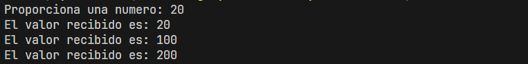

### Ejemplo de una Función en C

```c
#include <stdio.h>

// 1. Definir una funcion
int sumar(int a, int b)
{
  int resultadoSuma = a + b;
  return resultadoSuma;
}

int main()
{
  // 2. Llamamos la función
  int argA, argB, resultado;
  printf("Proporciona el primer argumento: ");
  scanf("%d", &argA);
  printf("\nProporciona el segundo argumento: ");
  scanf("%d", &argB);

  resultado = sumar(argA, argB);
  printf("Resultado de la suma: %d", resultado);

  return 0;
}
```

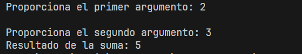

### Copia de Valores

```c
// Definimos variables
int a = 10;
// -> Se copia el valor de 'a' a la variable 'b'
int b = a; 
// -> Sólo se modifica el valor de 'b',
// no afecta a 'a'
b = 20; 
```

**En memoria:**

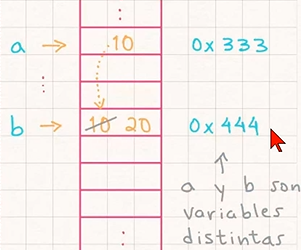

### Ejemplo de Copia de valores

```c
#include <stdio.h>

// Copia de valores en C
int main()
{
  int a = 10;
  int b = a;
  b = 20;
  printf("Valor a: %d\n", a);
  printf("Valor b: %d\n", b);

  return 0;
}
```

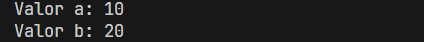

### Apuntadores (Copia de la Referencia de Memoria)

**Sintáxis:**

```c
// Variables
int a = 10;
// *b es un apuntador a la variable 'a'
int *b = &a;
printf("%d",a); // -> imprimir 10
printf("%d",*b); // -> imprimir 10
printf("%p",b); // -> imprimir 0x333

// Modificamos el valor de la variable
*b = 20;
printf("%d", a); // imprime 20
printf("%d", *b); // imprime 20
```

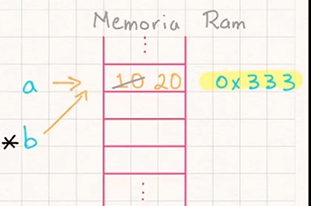

- `int a = 10;`: Declara una variable entera `a` con valor `10`.
- `int *b = &a;`: Declara un apuntador `b` que almacena la dirección de la variable `a`.
- `printf("%d", a);`: Imprime el valor de `a` (`10`).
- `printf("%d", *b);`: Usa el apuntador `b` para imprimir el valor de `a` (`10`).
- `printf("%p", b);`: Imprime la dirección de memoria de `a`.

**Modificación a través del apuntador:**

- `*b = 20;`: Cambia el valor de `a` a `20` usando el apuntador `b`.
- Nuevamente, `printf("%d", a);` y `printf("%d", *b);` imprimen `20`, ya que `*b` afecta directamente a `a`.

### Ejemplo de Apuntadores en C

```c
#include <stdio.h>

// Copia de la referencia de memoria (apuntadores)
int main()
{
  int a = 10;
  // Definimos una variable apuntador
  int *b = &a;
  // Modificamos el valor de a o *b
  // *variable -> desreferencia
  *b = 20;
  // Si imprimir los valores
  printf("Valor a: %d\n", a);
  printf("Valor *b: %d\n", *b);
  // Imprimir direcciones de memoria
  // %p -> pointer (apuntador)
  printf("Referencia &a: %p\n", &a);
  printf("Referencia (apunta) b: %p\n", b);
  printf("Referencia &b: %p\n", &b);

  return 0;
}
```

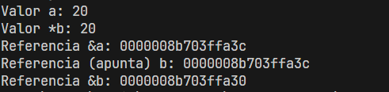

Este código demuestra cómo trabajar con variables, apuntadores y direcciones de memoria en C. Aquí está un resumen de lo que hace cada parte:

1. **`int a = 10;`**  
   Declara una variable entera `a` con valor `10`.

2. **`int *b = &a;`**  
   Declara un apuntador `b` que almacena la dirección de memoria de `a`.

3. **`*b = 20;`**  
   Cambia el valor de `a` a `20` utilizando el apuntador `b` (desreferenciándolo).

4. **Impresión de valores:**
   - **`printf("Valor a: %d\n", a);`**  
     Imprime el valor de `a` (`20`).
   - **`printf("Valor *b: %d\n", *b);`**  
     Imprime el valor apuntado por `b`, que también es `20`.

5. **Impresión de direcciones de memoria:**
   - **`printf("Referencia &a: %p\n", &a);`**  
     Imprime la dirección de memoria de `a`.
   - **`printf("Referencia (apunta) b: %p\n", b);`**  
     Imprime la dirección almacenada en `b`, que es la misma que `&a`.
   - **`printf("Referencia &b: %p\n", &b);`**  
     Imprime la dirección de memoria del apuntador `b`.

**Salida esperada (ejemplo):**

```cmd
Valor a: 20  
Valor *b: 20  
Referencia &a: 0x7ffeea0bf27c  
Referencia (apunta) b: 0x7ffeea0bf27c  
Referencia &b: 0x7ffeea0bf270  
```

### Paso por Valor

```c
//                parametro = 10
void pasoPorValor(int parametro) {
  parametro = 20;
}
int main() {
  int argumento = 10;
  pasoPorValor(argumento);
  printf("%d", argumento); // -> Imprime 10
}
```

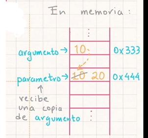

> [!NOTE]
> **Conclusión:** Los cambios hechos en la función No afecta a la variable externa, solo se recibió una copia, son variables distintas.

### Ejemplo de Paso por Valor en c

```c
#include <stdio.h>

// Paso por Valor
void cambiarValor(int parametro)
{
  parametro = 20;
}

int main()
{
  int argumento = 10;
  printf("Antes de llamar funcion: %d", argumento);
  cambiarValor(argumento);
  printf("\nDespues de llamar funcion: %d", argumento);

  return 0;
}
```

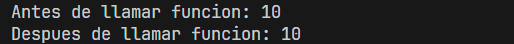

### Paso por Referencia

En este ejemplo se ilustra el paso por referencia en C, donde se modifica directamente el valor de una variable en la función llamada. Aquí tienes una explicación paso a paso:

```c
void pasoRerencia(int *parametro) {
  *parametro = 20;
}

int main() {
  int argumento = 10;

  pasoReferencia(&argumento);
  printf("%d", argumento); // -> imprime 20
  return 0;
}
```

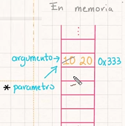

> [!NOTE]
> **Conclusión:** Los cambios hechos en la función Si afectan a la variable externa, ya que se recibió la referencia o dirección de memoria de la variable externa.

**Código explicado:**

1. **`void pasoReferencia(int *parametro)`**
   - Declara una función que toma un apuntador (`int *`) como parámetro.
   - Dentro de la función, el operador `*` desreferencia el apuntador, permitiendo modificar el valor al que apunta.

2. **`int main()`**
   - Declara una variable `argumento` con valor inicial `10`.

3. **`pasoReferencia(&argumento);`**
   - Llama a la función `pasoReferencia`, pasando la dirección de memoria de `argumento` (con `&`).
   - Dentro de la función, `*parametro = 20;` actualiza directamente el valor de `argumento` en la memoria.

4. **`printf("%d", argumento);`**
   - Imprime el valor de `argumento`, que ahora es `20` tras la modificación en la función.

**Flujo de ejecución:**

1. Se inicializa `argumento = 10`.
2. Se pasa la dirección de `argumento` a la función.
3. La función desreferencia el apuntador y cambia el valor en la memoria de `10` a `20`.
4. El valor actualizado de `argumento` se imprime como `20`.

**Salida esperada:**

```plaintext
20
```

---

**Ventajas del paso por referencia:**

- Permite modificar directamente variables fuera de la función.
- Ahorra memoria, ya que no se copia el valor completo, sino solo su dirección.
- Útil para estructuras grandes como arreglos o estructuras complejas.

### Ejemplo de Paso por Referencia en C

```c
#include <stdio.h>

// Paso por referencia
void cambiarValor(int *parametro)
{
  // Desreferencia podemos modificar el valor de la variable
  *parametro = 20;
}

int main()
{
  int argumento = 10;
  printf("Antes de llamar la funcion: %d", argumento);
  cambiarValor(&argumento);
  printf("\nDespues de llamar la funcion: %d", argumento);

  return 0;
}
```

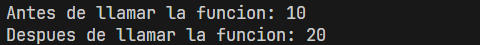

### Arreglos y Apuntadores en C

**Copia Referencia en Arreglos:**

En este ejemplo, se analiza cómo funcionan los arreglos y los apuntadores en C cuando se comparte la referencia entre ellos. Sin embargo, el código presentado tiene un error de sintaxis y concepto. Vamos a corregirlo y explicar su funcionamiento.

```c
int arreglo1[] = {100,200};
// Copiamos la referencia
int *arreglo2[] = arreglo1;
// |-> Apuntan a la misma direccion de memoria
arreglo2[0] = 500; // -> Un cambio en arreglo2 modifica a arreglo1
printf("%d", arreglo1[0]); // Imprime 500
printf("%d", arreglo2[0]); // Imprime 500
// Apuntan a la misma referencia 
```

**Código corregido y explicado:**

1. **Declaración y copia de referencia**

 ```c
 int arreglo1[] = {100, 200};
 int *arreglo2 = arreglo1; // Se copia la dirección base de arreglo1 en arreglo2
 ```

- `arreglo1` es un arreglo que contiene dos elementos: `{100, 200}`.
- `arreglo2` es un apuntador que apunta al primer elemento de `arreglo1` (dirección base del arreglo).

**Modificación a través de la referencia:**

 ```c
 arreglo2[0] = 500; // Cambia el valor del primer elemento de arreglo1
 ```

- Como `arreglo2` apunta a `arreglo1`, cualquier cambio en `arreglo2` afecta directamente a `arreglo1`.

**Impresión de valores:**

   ```c
   printf("%d\n", arreglo1[0]); // Imprime 500
   printf("%d\n", arreglo2[0]); // Imprime 500
   ```

- Ambos imprimen el mismo valor (`500`), ya que comparten la misma referencia.

**Explicación clave:**

- **Arreglos como apuntadores**: En C, los arreglos son esencialmente apuntadores constantes a su primer elemento.
- **Referencia compartida**: `arreglo2` apunta al mismo bloque de memoria que `arreglo1`. Cualquier modificación afecta ambas referencias.
- **Nota sobre la declaración original**: La línea `int *arreglo2[] = arreglo1;` no es válida porque `arreglo2` está siendo declarada como un arreglo de apuntadores (`int *arreglo2[]`), no como un simple apuntador (`int *arreglo2`).

- **Paso por Referencia con Arreglos**

```c
void pasoReferencia(int *parametro) {
  parametro[0] = 500; // -> No se requiere usar '*' para acceder al valor
  parametro[1] = 600; // -> No se requiere usar '*' para acceder al valor
}
int main() {
  int argumento[] = {100, 200};
  pasoReferencia(argumento); // -> No requiere '&'
  printf("%d", argumento[0]); // -> imprime 500
  printf("%d", argumento[1]); // -> imprime 600
}
```

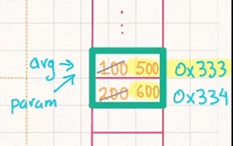

> [!NOTE]
> **Conclusión:** Los arreglos se pasan por referencia por default. No se requiere pasar con `&`

### Ejemplo Arreglos y Apuntadores en C

```c
#include <stdio.h>

void cambiarValor(int *parametro)
{
  // Cambiamos los valores del arreglo
  parametro[0] = 4;
  parametro[1] = 5;
  parametro[2] = 6;
}

int main()
{
  // Definir arreglo
  int arg[] = {1, 2, 3};
  printf("Valores arreglo antes: %d %d %d", arg[0], arg[1], arg[2]);
  cambiarValor(arg);
  printf("\nValores arreglo despues: %d %d %d", arg[0], arg[1], arg[2]);

  return 0;
}
```

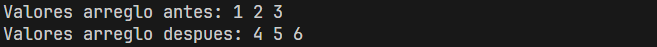

### Ejemplo de Cadena y Funciones en C

```c
#include <stdio.h>

// void imprimirMensaje(char *mensaje)
void imprimirMensaje(char mensaje[])
{
  // Imprimimos el mensaje
  printf("Mensaje: %s", mensaje);
}

int main()
{
  // Definir la cadena
  char cadena[5];
  printf("Proporciona el mensaje a mostrar: \n");
  gets(cadena);
  imprimirMensaje(cadena);

  return 0;
}
```

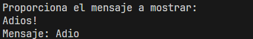

### Más de Cadenas y Apuntadores en C

```c
#include <stdio.h>

// void imprimirMensaje(char *mensaje)
void imprimirMensaje(char mensaje[])
{
  // Imprimimos el mensaje
  mensaje = "Adios";
  printf("Mensaje: %s", mensaje);
  // mensaje[0] = 'h';
}

int main()
{
  // Definir la cadena
  // char cadena[5];
  char *cadena = "Hola";
  imprimirMensaje(cadena);
  printf("\nCadena original: %s", cadena);

  return 0;
}
```

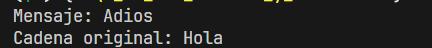

### Alcance de Variables en C

Es la región del programa donde se define, declara y utiliza una variable.

- **Alcance Global:** Alcanza a todo el programa, pero es el menos utilizado.
- **Alcance Local:** Se puede determinar dónde empieza y acaba el alcance de las variables locales basándose en el nivel más alto y en cada bloque de definición de una clase o módulo.

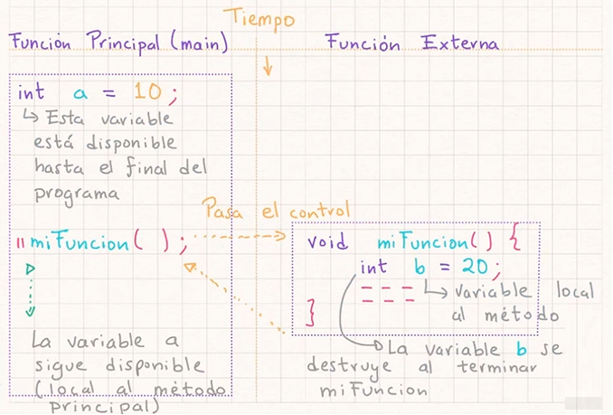

### Ejemplo de Alcance de Variables en C

```c
#include <stdio.h>

// Variables globales
int variableGlobal = 10;

void miFuncion(int variableLocalFuncion)
{
  variableLocalFuncion = 40;
  variableGlobal = 50;
}

int main()
{
  // Variable local metodo main
  int variableLocalMain = 20;

  miFuncion(30);

  variableGlobal = 60;
  // Imprimimos valores
  printf("\nVariable locla main: %d", variableLocalMain);
  printf("\nVariable global: %d", variableGlobal);

  return 0;
}
```

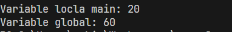

### Funciones Recursivas en C

Es una función que se llama a si misma. La recursión es un proceso en el que el programa repite una sección de código de manera similar.

**Reglas Funciones Recursivas:**

1. Una función que se llama a si misma.
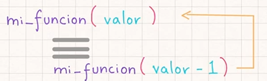
2. Debe avanzar hacia un caso base, de lo contrario caemos en ciclos infinitos.


### Ejemplo de Funciones Recursivas en C

```c
#include <stdio.h>

// Declarar una funcion
void funcionRecursiva(int numero)
{
  // Caso Base
  if (numero == 1)
  {
    printf("%d\n", numero);
  }
  else
  {
    // Caso Recursivo
    funcionRecursiva(numero - 1);
    printf("%d\n", numero);
  }
}

int main()
{
  // Imprimir 5 al 1
  int valor = 5;
  funcionRecursiva(valor);

  return 0;
}
```

**Ejecutar:**

```plaintext
1
2
3
4
5
```

---

## Funciones Incorporadas al lenguaje C

## Conclusión
